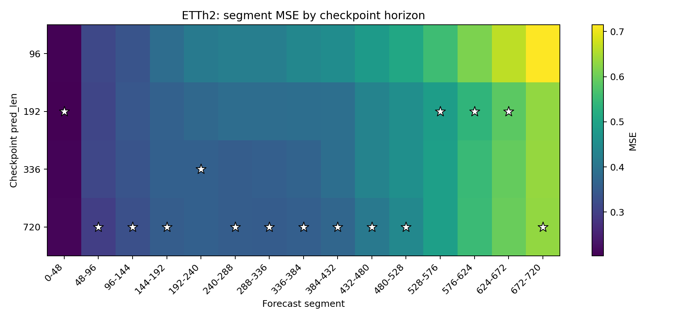
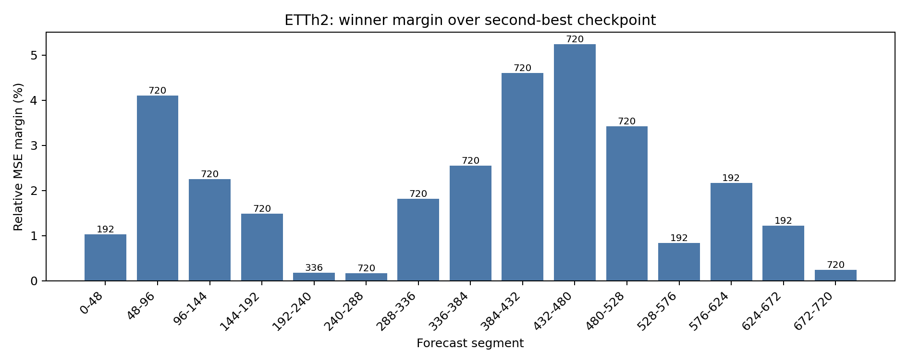
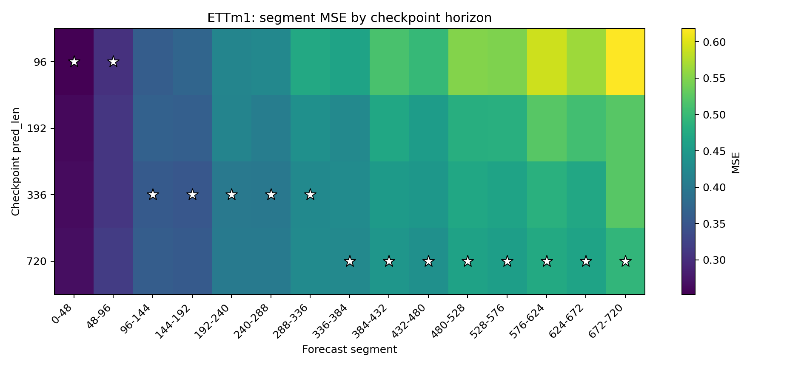
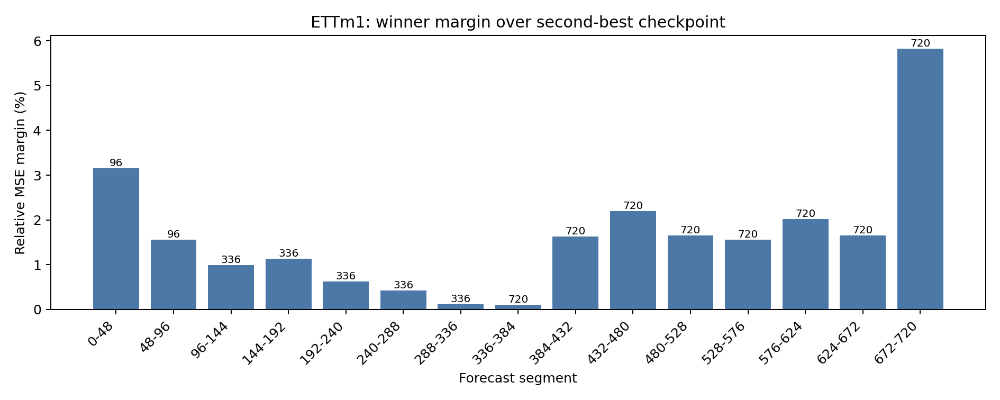
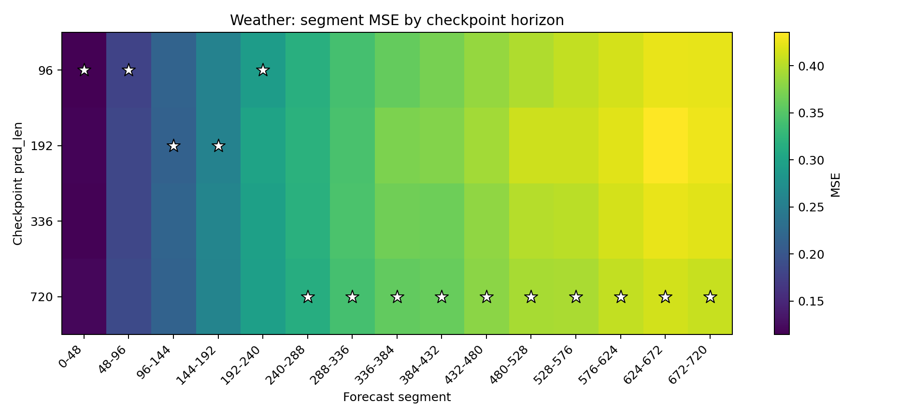
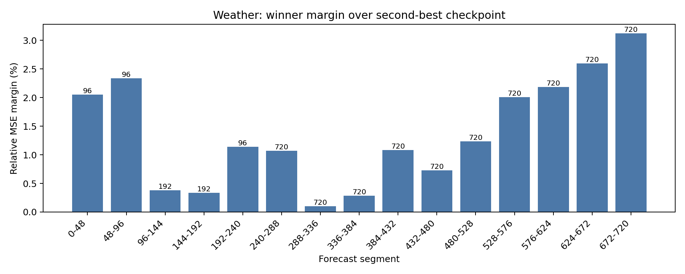

# Phase0 Segment-wise Checkpoint Oracle

## Setup

- Target horizon: `720`
- Segment length: `48`
- Short checkpoints are extended to the target horizon with rolling autoregression.
- Winner is selected by segment MSE.

## Winner Table

| Dataset | Segment | Best pred_len | Best MSE | Second pred_len | Second MSE | Relative margin |
| --- | ---: | ---: | ---: | ---: | ---: | ---: |
| ETTh2 | 0-48 | 192 | 0.202995 | 96 | 0.205092 | 1.03% |
| ETTh2 | 48-96 | 720 | 0.297708 | 192 | 0.309929 | 4.11% |
| ETTh2 | 96-144 | 720 | 0.328323 | 96 | 0.335733 | 2.26% |
| ETTh2 | 144-192 | 720 | 0.354018 | 336 | 0.359297 | 1.49% |
| ETTh2 | 192-240 | 336 | 0.360007 | 720 | 0.360644 | 0.18% |
| ETTh2 | 240-288 | 720 | 0.353408 | 336 | 0.354005 | 0.17% |
| ETTh2 | 288-336 | 720 | 0.351582 | 336 | 0.357981 | 1.82% |
| ETTh2 | 336-384 | 720 | 0.357605 | 336 | 0.366723 | 2.55% |
| ETTh2 | 384-432 | 720 | 0.371713 | 336 | 0.388820 | 4.60% |
| ETTh2 | 432-480 | 720 | 0.410250 | 192 | 0.431757 | 5.24% |
| ETTh2 | 480-528 | 720 | 0.441628 | 192 | 0.456743 | 3.42% |
| ETTh2 | 528-576 | 192 | 0.488238 | 336 | 0.492322 | 0.84% |
| ETTh2 | 576-624 | 192 | 0.538103 | 336 | 0.549787 | 2.17% |
| ETTh2 | 624-672 | 192 | 0.586510 | 336 | 0.593702 | 1.23% |
| ETTh2 | 672-720 | 720 | 0.631107 | 192 | 0.632646 | 0.24% |
| ETTm1 | 0-48 | 96 | 0.252701 | 192 | 0.260676 | 3.16% |
| ETTm1 | 48-96 | 96 | 0.305270 | 192 | 0.310033 | 1.56% |
| ETTm1 | 96-144 | 336 | 0.356639 | 720 | 0.360185 | 0.99% |
| ETTm1 | 144-192 | 336 | 0.352517 | 720 | 0.356521 | 1.14% |
| ETTm1 | 192-240 | 336 | 0.401071 | 720 | 0.403565 | 0.62% |
| ETTm1 | 240-288 | 336 | 0.399635 | 720 | 0.401335 | 0.43% |
| ETTm1 | 288-336 | 336 | 0.426359 | 720 | 0.426873 | 0.12% |
| ETTm1 | 336-384 | 720 | 0.424016 | 192 | 0.424449 | 0.10% |
| ETTm1 | 384-432 | 720 | 0.444981 | 336 | 0.452210 | 1.62% |
| ETTm1 | 432-480 | 720 | 0.436052 | 336 | 0.445615 | 2.19% |
| ETTm1 | 480-528 | 720 | 0.463101 | 336 | 0.470764 | 1.65% |
| ETTm1 | 528-576 | 720 | 0.457366 | 336 | 0.464513 | 1.56% |
| ETTm1 | 576-624 | 720 | 0.475325 | 336 | 0.484953 | 2.03% |
| ETTm1 | 624-672 | 720 | 0.464458 | 336 | 0.472165 | 1.66% |
| ETTm1 | 672-720 | 720 | 0.493823 | 336 | 0.522597 | 5.83% |
| Weather | 0-48 | 96 | 0.114541 | 336 | 0.116893 | 2.05% |
| Weather | 48-96 | 96 | 0.178760 | 192 | 0.182936 | 2.34% |
| Weather | 96-144 | 192 | 0.214606 | 720 | 0.215419 | 0.38% |
| Weather | 144-192 | 192 | 0.256220 | 96 | 0.257085 | 0.34% |
| Weather | 192-240 | 96 | 0.292105 | 720 | 0.295444 | 1.14% |
| Weather | 240-288 | 720 | 0.313959 | 96 | 0.317311 | 1.07% |
| Weather | 288-336 | 720 | 0.340912 | 96 | 0.341259 | 0.10% |
| Weather | 336-384 | 720 | 0.358428 | 96 | 0.359443 | 0.28% |
| Weather | 384-432 | 720 | 0.361200 | 336 | 0.365103 | 1.08% |
| Weather | 432-480 | 720 | 0.379849 | 336 | 0.382620 | 0.73% |
| Weather | 480-528 | 720 | 0.392845 | 96 | 0.397708 | 1.24% |
| Weather | 528-576 | 720 | 0.394417 | 336 | 0.402328 | 2.01% |
| Weather | 576-624 | 720 | 0.406337 | 96 | 0.415222 | 2.19% |
| Weather | 624-672 | 720 | 0.413511 | 96 | 0.424251 | 2.60% |
| Weather | 672-720 | 720 | 0.408240 | 336 | 0.420993 | 3.12% |

## Figures

### ETTh2

### ETTm1

### Weather

