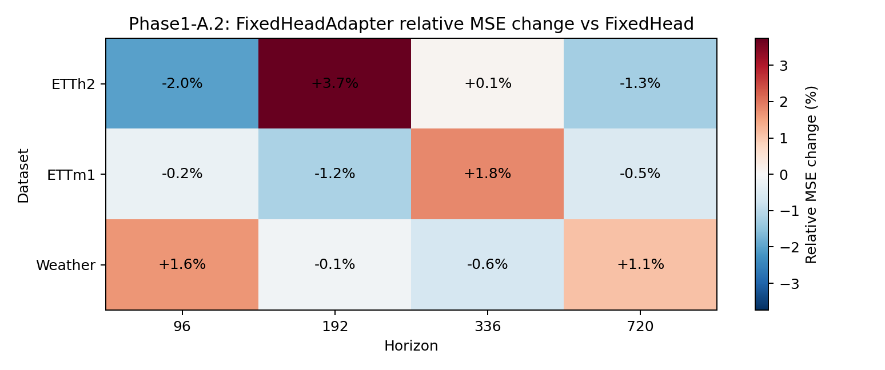
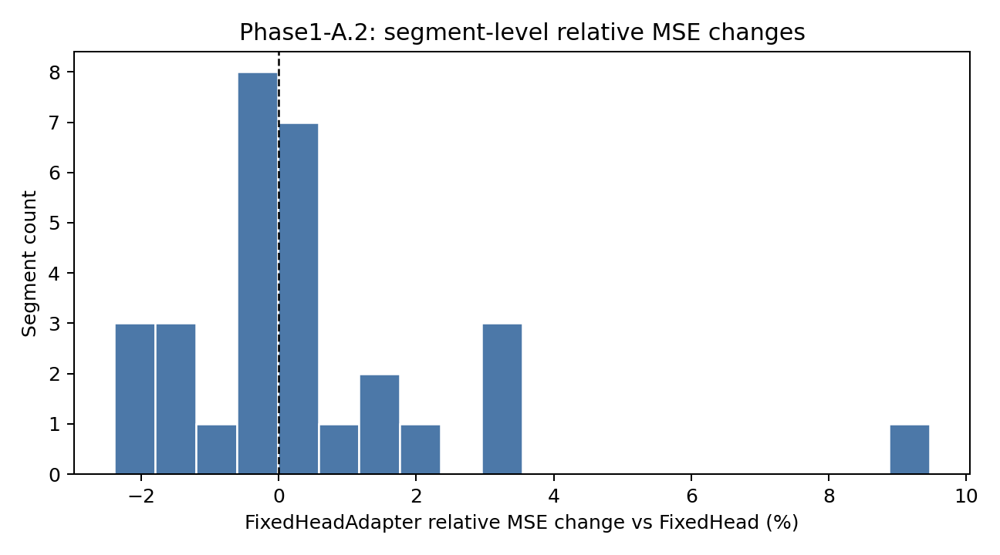

# Phase1-A.2 Fixed-Head Adapter Gate 结果报告

## 实验定位

[Fact] 本实验检验 `PatchEncoderFixedHeadAdapter` 是否能在保留 fixed flatten head
readout capacity 的前提下，引入有效 future-segment conditioning。

## 主结论

[Evidence] `PatchEncoderFixedHeadAdapter` main MSE wins: `7/12`。
MSE relative change 范围为 `-2.02%` 到
`+3.74%`，平均为 `+0.20%`。

[Evidence] segment-level MSE wins: `15/30`。
segment relative MSE 平均为 `+0.49%`。

[Evidence] adapter 对 base prediction 的平均 MAE 修正比例为 `0.3200`。

[Decision] `partial_pass`: main wins 达到最低通过线，但平均 relative MSE 仍为正退化，不足以作为论文核心 claim。

[Decision] 该结果证明保留 fixed-head capacity 后，future-side adapter 不再系统性失败；
但当前收益幅度和稳定性不足，不能直接作为 decoder 论文主创新。下一步应回退到
training-only future-aware teacher/student alignment，而不是继续只增加 history-only
adapter capacity。

## Main Metric Table

| Dataset | Horizon | Fixed MSE | Adapter MSE | Rel MSE | Fixed MAE | Adapter MAE | Rel MAE | Param ratio |
| --- | ---: | ---: | ---: | ---: | ---: | ---: | ---: | ---: |
| ETTh2 | 96 | 0.307448 | 0.301230 | -2.02% | 0.366091 | 0.360040 | -1.65% | 1.158 |
| ETTh2 | 192 | 0.377340 | 0.391453 | +3.74% | 0.406947 | 0.418699 | +2.89% | 1.101 |
| ETTh2 | 336 | 0.384115 | 0.384464 | +0.09% | 0.421288 | 0.418298 | -0.71% | 1.066 |
| ETTh2 | 720 | 0.407403 | 0.402263 | -1.26% | 0.443847 | 0.439451 | -0.99% | 1.034 |
| ETTm1 | 96 | 0.290475 | 0.289781 | -0.24% | 0.344233 | 0.346482 | +0.65% | 1.158 |
| ETTm1 | 192 | 0.337701 | 0.333742 | -1.17% | 0.373389 | 0.371241 | -0.58% | 1.101 |
| ETTm1 | 336 | 0.361540 | 0.367995 | +1.79% | 0.390765 | 0.394994 | +1.08% | 1.066 |
| ETTm1 | 720 | 0.412788 | 0.410607 | -0.53% | 0.420701 | 0.421233 | +0.13% | 1.034 |
| Weather | 96 | 0.147087 | 0.149514 | +1.65% | 0.195054 | 0.202269 | +3.70% | 1.158 |
| Weather | 192 | 0.195208 | 0.194955 | -0.13% | 0.241885 | 0.242556 | +0.28% | 1.101 |
| Weather | 336 | 0.250787 | 0.249212 | -0.63% | 0.287118 | 0.284838 | -0.79% | 1.066 |
| Weather | 720 | 0.323127 | 0.326648 | +1.09% | 0.335469 | 0.340550 | +1.51% | 1.034 |

## 图像

## 机制诊断

[Inference] 若 adapter 取得正收益且 `delta_to_base_mae_ratio` 非零，说明 future-side
conditioning 在 fixed readout 外提供了实际修正；若正收益很小且修正比例接近 0，
则更可能是训练波动而不是机制收益。

[Inference] 若 adapter 大面积退化，说明仅用 history-derived segment queries 做
post-readout affine conditioning 不足以构成 decoder 创新，应回退到 future-aware
teacher/student alignment，而不是继续增加 adapter 容量。

Best setting: `ETTh2 / H=96` with
`-2.02%` relative MSE change.

Worst setting: `ETTh2 / H=192` with
`+3.74%` relative MSE change.

## Adapter Delta Stats

| Dataset | Horizon | Delta/Base MAE Ratio | Mean abs gamma | Mean abs beta |
| --- | ---: | ---: | ---: | ---: |
| ETTh2 | 96 | 0.103470 | 0.370362 | 0.038697 |
| ETTh2 | 192 | 0.182037 | 0.519209 | 0.077236 |
| ETTh2 | 336 | 0.075444 | 0.377323 | 0.023160 |
| ETTh2 | 720 | 0.073619 | 0.412849 | 0.022099 |
| ETTm1 | 96 | 0.488611 | 0.591042 | 0.020684 |
| ETTm1 | 192 | 0.412850 | 0.524752 | 0.015569 |
| ETTm1 | 336 | 0.484595 | 0.578349 | 0.024292 |
| ETTm1 | 720 | 0.439145 | 0.539931 | 0.029068 |
| Weather | 96 | 0.331531 | 0.561046 | 0.017795 |
| Weather | 192 | 0.420092 | 0.665293 | 0.033347 |
| Weather | 336 | 0.415309 | 0.650352 | 0.038958 |
| Weather | 720 | 0.413747 | 0.659383 | 0.030598 |

## Adapter Query Similarity

| Dataset | Horizon | Pairs | Mean cosine | Min | Max |
| --- | ---: | ---: | ---: | ---: | ---: |
| ETTh2 | 96 | 1 | 0.0876 | 0.0876 | 0.0876 |
| ETTh2 | 192 | 6 | 0.0683 | -0.0312 | 0.1608 |
| ETTh2 | 336 | 21 | -0.0067 | -0.1451 | 0.1819 |
| ETTh2 | 720 | 105 | 0.0438 | -0.1638 | 0.2402 |
| ETTm1 | 96 | 1 | 0.2214 | 0.2214 | 0.2214 |
| ETTm1 | 192 | 6 | 0.0589 | -0.0498 | 0.1821 |
| ETTm1 | 336 | 21 | 0.0074 | -0.2343 | 0.2134 |
| ETTm1 | 720 | 105 | 0.0538 | -0.1708 | 0.2687 |
| Weather | 96 | 1 | 0.2061 | 0.2061 | 0.2061 |
| Weather | 192 | 6 | 0.1841 | 0.1205 | 0.2724 |
| Weather | 336 | 21 | 0.0816 | -0.1081 | 0.2772 |
| Weather | 720 | 105 | 0.0663 | -0.1520 | 0.2721 |
