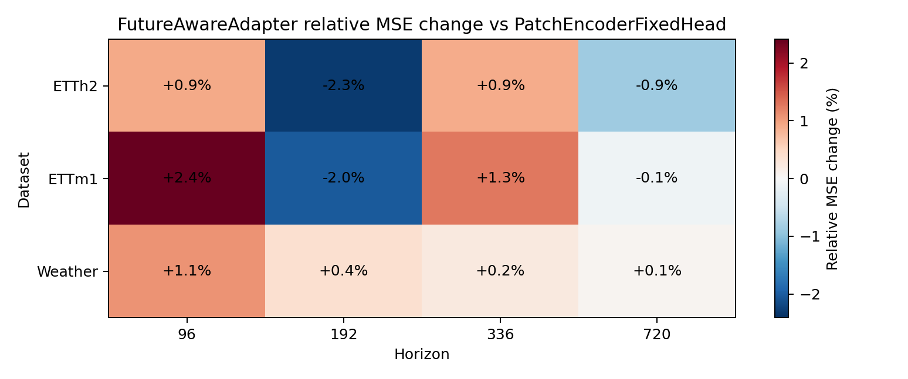
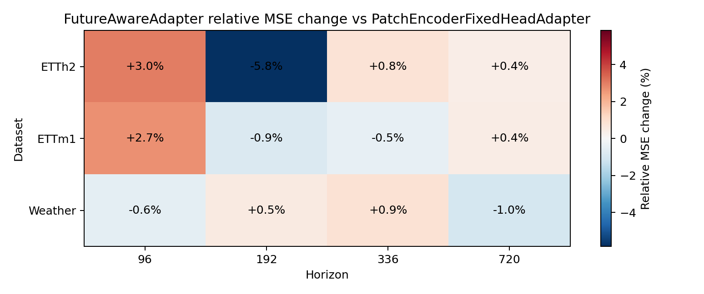

# Phase1-A.3 Future-Aware Adapter Gate 结果报告

## 实验定位

[Fact] 本实验检验 training-only future teacher branch 是否能让 history-derived
future segment adapter 获得稳定收益。推理路径不接收 ground-truth future。

## 主结论

[Evidence] vs `PatchEncoderFixedHead`: main MSE wins `4/12`,
mean relative MSE `+0.16%`，range
`-2.32%` 到 `+2.41%`。

[Evidence] vs `PatchEncoderFixedHeadAdapter`: main MSE wins `5/12`,
mean relative MSE `-0.01%`。

[Evidence] leakage audit max abs prediction difference: `0.00000000`。

[Evidence] mean reconstruction loss by dataset: `ETTh2=1.0476`, `ETTm1=0.3953`, `Weather=645.0795`.

[Decision] `partial_pass`: future-aware adapter has some wins but does not yet provide stable average improvement.

[Decision] 当前结果不应直接作为论文核心 claim。它说明 teacher/student alignment
在无 leakage 条件下可运行，但 first candidate 没有稳定提升 fixed head；同时 Weather
的 reconstruction loss 明显失衡，下一步若修补，应优先做 scale-normalized reconstruction
或降低/移除 reconstruction weight，而不是扩大 teacher branch。

## 图像

## Vs FixedHead

| Dataset | Horizon | Fixed MSE | FutureAware MSE | Rel MSE | Fixed MAE | FutureAware MAE | Rel MAE |
| --- | ---: | ---: | ---: | ---: | ---: | ---: | ---: |
| ETTh2 | 96 | 0.307448 | 0.310247 | +0.91% | 0.366091 | 0.364518 | -0.43% |
| ETTh2 | 192 | 0.377340 | 0.368602 | -2.32% | 0.406947 | 0.404623 | -0.57% |
| ETTh2 | 336 | 0.384115 | 0.387549 | +0.89% | 0.421288 | 0.417755 | -0.84% |
| ETTh2 | 720 | 0.407403 | 0.403909 | -0.86% | 0.443847 | 0.441102 | -0.62% |
| ETTm1 | 96 | 0.290475 | 0.297478 | +2.41% | 0.344233 | 0.350752 | +1.89% |
| ETTm1 | 192 | 0.337701 | 0.330894 | -2.02% | 0.373389 | 0.371547 | -0.49% |
| ETTm1 | 336 | 0.361540 | 0.366162 | +1.28% | 0.390765 | 0.392225 | +0.37% |
| ETTm1 | 720 | 0.412788 | 0.412331 | -0.11% | 0.420701 | 0.419088 | -0.38% |
| Weather | 96 | 0.147087 | 0.148679 | +1.08% | 0.195054 | 0.198858 | +1.95% |
| Weather | 192 | 0.195208 | 0.195966 | +0.39% | 0.241885 | 0.243442 | +0.64% |
| Weather | 336 | 0.250787 | 0.251362 | +0.23% | 0.287118 | 0.287981 | +0.30% |
| Weather | 720 | 0.323127 | 0.323335 | +0.06% | 0.335469 | 0.339834 | +1.30% |

## Alignment Diagnostics

| Dataset | Horizon | Alignment loss | Recon loss | Teacher/student cosine | Leakage max abs | Delta/Base MAE Ratio |
| --- | ---: | ---: | ---: | ---: | ---: | ---: |
| ETTh2 | 96 | 0.793889 | 0.615656 | 0.206111 | 0.00000000 | 0.107034 |
| ETTh2 | 192 | 0.812599 | 0.885383 | 0.187401 | 0.00000000 | 0.102076 |
| ETTh2 | 336 | 0.829973 | 1.134986 | 0.170027 | 0.00000000 | 0.106278 |
| ETTh2 | 720 | 0.784252 | 1.554558 | 0.215748 | 0.00000000 | 0.119231 |
| ETTm1 | 96 | 0.335114 | 0.181937 | 0.664886 | 0.00000000 | 0.397432 |
| ETTm1 | 192 | 0.313504 | 0.234192 | 0.686496 | 0.00000000 | 0.472230 |
| ETTm1 | 336 | 0.579127 | 0.477182 | 0.420873 | 0.00000000 | 0.420437 |
| ETTm1 | 720 | 0.517783 | 0.687973 | 0.482217 | 0.00000000 | 0.453080 |
| Weather | 96 | 0.378688 | 381.323805 | 0.621312 | 0.00000000 | 0.322138 |
| Weather | 192 | 0.448912 | 488.748206 | 0.551088 | 0.00000000 | 0.295092 |
| Weather | 336 | 0.469362 | 583.915792 | 0.530638 | 0.00000000 | 0.444513 |
| Weather | 720 | 0.591855 | 1126.330209 | 0.408145 | 0.00000000 | 0.352182 |
