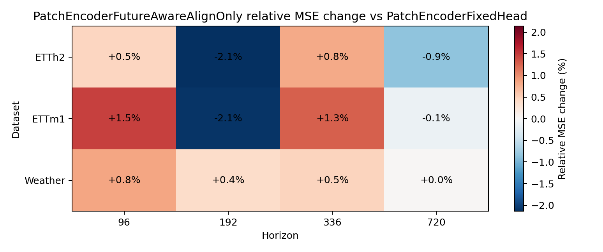
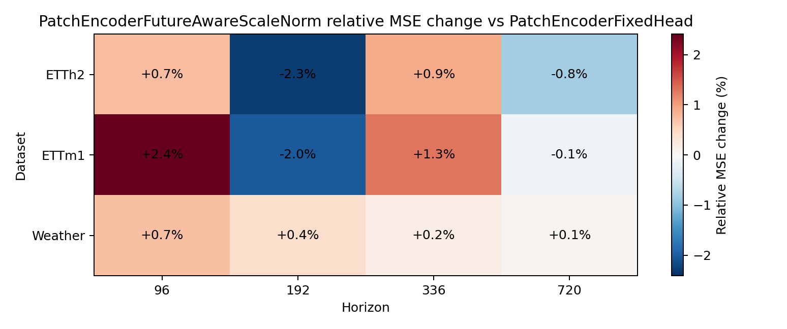

# Phase1-A.4 Future-Aware Repair Gate 结果报告

## 实验定位

[Fact] 本 gate 针对 Phase1-A.3 暴露的 reconstruction loss scale imbalance 做最小修补，
比较 `AlignOnly` 与 `ScaleNorm` 两个候选，而不扩大模型容量。

## 主结论

[Decision] `repair_partial`: repair improves some settings but still lacks stable fixed-head gains.

[Evidence] best candidate: `PatchEncoderFutureAwareAlignOnly`；leakage max abs `0.00000000`。

## Summary

| Candidate | Baseline | MSE wins | Mean Rel MSE | Range |
| --- | --- | ---: | ---: | --- |
| PatchEncoderFutureAwareAlignOnly | PatchEncoderFixedHead | 4/12 | +0.04% | -2.14% to +1.47% |
| PatchEncoderFutureAwareScaleNorm | PatchEncoderFixedHead | 4/12 | +0.12% | -2.28% to +2.41% |
| PatchEncoderFutureAwareAlignOnly | PatchEncoderFixedHeadAdapter | 5/12 | -0.13% | -5.67% to +2.54% |
| PatchEncoderFutureAwareScaleNorm | PatchEncoderFixedHeadAdapter | 5/12 | -0.05% | -5.81% to +2.82% |

## Heatmaps

## Alignment Diagnostics

| Model | Dataset | Horizon | Alignment loss | Recon loss | Raw recon loss | Cosine | Leakage | Delta/Base MAE |
| --- | --- | ---: | ---: | ---: | ---: | ---: | ---: | ---: |
| PatchEncoderFutureAwareAlignOnly | ETTh2 | 96 | 0.816975 | 2.396646 | 2.396646 | 0.183025 | 0.00000000 | 0.106209 |
| PatchEncoderFutureAwareAlignOnly | ETTh2 | 192 | 0.814147 | 2.572542 | 2.572542 | 0.185853 | 0.00000000 | 0.103022 |
| PatchEncoderFutureAwareAlignOnly | ETTh2 | 336 | 0.840994 | 2.837746 | 2.837746 | 0.159006 | 0.00000000 | 0.107185 |
| PatchEncoderFutureAwareAlignOnly | ETTh2 | 720 | 0.814654 | 4.005499 | 4.005499 | 0.185346 | 0.00000000 | 0.119754 |
| PatchEncoderFutureAwareAlignOnly | ETTm1 | 96 | 0.720017 | 1.924543 | 1.924543 | 0.279983 | 0.00000000 | 0.367296 |
| PatchEncoderFutureAwareAlignOnly | ETTm1 | 192 | 0.721977 | 2.065632 | 2.065632 | 0.278023 | 0.00000000 | 0.449958 |
| PatchEncoderFutureAwareAlignOnly | ETTm1 | 336 | 0.777899 | 2.137294 | 2.137294 | 0.222101 | 0.00000000 | 0.408582 |
| PatchEncoderFutureAwareAlignOnly | ETTm1 | 720 | 0.730134 | 2.572507 | 2.572507 | 0.269866 | 0.00000000 | 0.448565 |
| PatchEncoderFutureAwareAlignOnly | Weather | 96 | 0.515489 | 391.281351 | 391.281351 | 0.484511 | 0.00000000 | 0.305276 |
| PatchEncoderFutureAwareAlignOnly | Weather | 192 | 0.597715 | 493.878828 | 493.878828 | 0.402285 | 0.00000000 | 0.279953 |
| PatchEncoderFutureAwareAlignOnly | Weather | 336 | 0.658806 | 603.230315 | 603.230315 | 0.341194 | 0.00000000 | 0.414046 |
| PatchEncoderFutureAwareAlignOnly | Weather | 720 | 0.697649 | 1135.635687 | 1135.635687 | 0.302351 | 0.00000000 | 0.351084 |
| PatchEncoderFutureAwareScaleNorm | ETTh2 | 96 | 0.823590 | 0.600557 | 1.094264 | 0.176410 | 0.00000000 | 0.106353 |
| PatchEncoderFutureAwareScaleNorm | ETTh2 | 192 | 0.823515 | 0.529890 | 1.078689 | 0.176485 | 0.00000000 | 0.102713 |
| PatchEncoderFutureAwareScaleNorm | ETTh2 | 336 | 0.830772 | 0.528690 | 1.303967 | 0.169228 | 0.00000000 | 0.106267 |
| PatchEncoderFutureAwareScaleNorm | ETTh2 | 720 | 0.788740 | 0.459761 | 1.776999 | 0.211260 | 0.00000000 | 0.119410 |
| PatchEncoderFutureAwareScaleNorm | ETTm1 | 96 | 0.334693 | 0.087662 | 0.181660 | 0.665307 | 0.00000000 | 0.397608 |
| PatchEncoderFutureAwareScaleNorm | ETTm1 | 192 | 0.313749 | 0.098691 | 0.234465 | 0.686251 | 0.00000000 | 0.472146 |
| PatchEncoderFutureAwareScaleNorm | ETTm1 | 336 | 0.581421 | 0.177836 | 0.477487 | 0.418579 | 0.00000000 | 0.420413 |
| PatchEncoderFutureAwareScaleNorm | ETTm1 | 720 | 0.522810 | 0.198574 | 0.691336 | 0.477190 | 0.00000000 | 0.452881 |
| PatchEncoderFutureAwareScaleNorm | Weather | 96 | 0.415941 | 0.331117 | 382.177456 | 0.584059 | 0.00000000 | 0.318854 |
| PatchEncoderFutureAwareScaleNorm | Weather | 192 | 0.537733 | 0.447009 | 489.104195 | 0.462267 | 0.00000000 | 0.286581 |
| PatchEncoderFutureAwareScaleNorm | Weather | 336 | 0.694284 | 0.456142 | 584.713992 | 0.305716 | 0.00000000 | 0.422722 |
| PatchEncoderFutureAwareScaleNorm | Weather | 720 | 0.674563 | 0.571514 | 1126.614075 | 0.325437 | 0.00000000 | 0.351244 |
