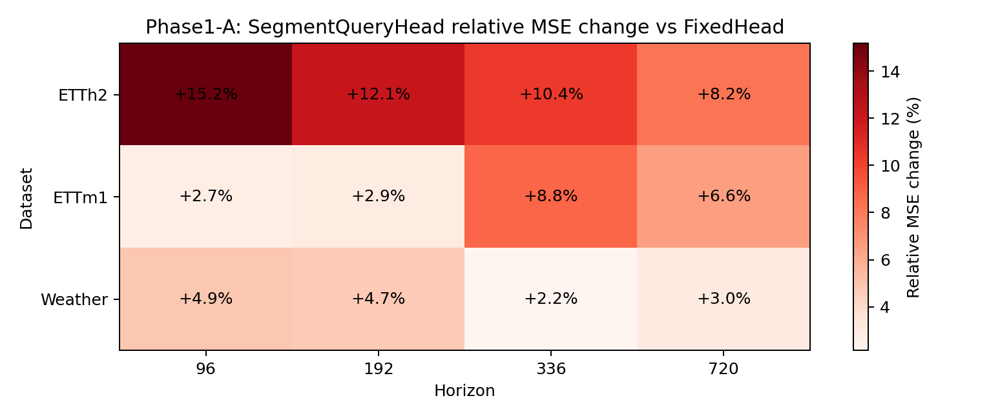
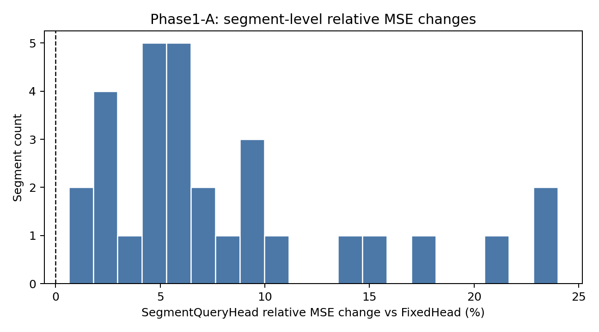

# Phase1-A Future-Segment Decoder Gate 结果报告

## 实验定位

[Fact] 本实验对应长研究执行模板的第 8-10 步：远程训练、评估结果、判断是否通过。

[Fact] 远程 gate 使用 `PatchEncoderFixedHead` 与 `PatchEncoderSegmentQueryHead`，在
`ETTh2`、`ETTm1`、`Weather` 和 horizons `{96,192,336,720}` 上进行 one-to-one
training。代码版本来自远程 driver log：`b90ce0b8fbed4759f361ea30687d9e5ce1cb3188`。

## 主结论

[Strong Evidence] `PatchEncoderSegmentQueryHead` 在 12/12 个 dataset-horizon 设置上
均未超过 `PatchEncoderFixedHead`。MSE relative change 范围为
`+2.16%` 到 `+15.17%`，
平均为 `+6.79%`。

[Strong Evidence] segment-level comparison 也没有形成补救证据：总计 `30`
个 segment 评价项中，SegmentQueryHead 只赢 `0` 个。

[Decision] Phase1-A 第一版 `PatchEncoderSegmentQueryHead` 不通过。它不能作为论文核心
decoder 创新点，也不应进入 Phase1-B one-model compatibility。

## Main Metric Table

| Dataset | Horizon | Fixed MSE | Segment MSE | Rel MSE | Fixed MAE | Segment MAE | Rel MAE | Param ratio |
| --- | ---: | ---: | ---: | ---: | ---: | ---: | ---: | ---: |
| ETTh2 | 96 | 0.307448 | 0.354093 | +15.17% | 0.366091 | 0.404166 | +10.40% | 0.591 |
| ETTh2 | 192 | 0.377340 | 0.422974 | +12.09% | 0.406947 | 0.442863 | +8.83% | 0.379 |
| ETTh2 | 336 | 0.384115 | 0.423898 | +10.36% | 0.421288 | 0.445173 | +5.67% | 0.246 |
| ETTh2 | 720 | 0.407403 | 0.440719 | +8.18% | 0.443847 | 0.465829 | +4.95% | 0.128 |
| ETTm1 | 96 | 0.290475 | 0.298330 | +2.70% | 0.344233 | 0.350532 | +1.83% | 0.591 |
| ETTm1 | 192 | 0.337701 | 0.347429 | +2.88% | 0.373389 | 0.389445 | +4.30% | 0.379 |
| ETTm1 | 336 | 0.361540 | 0.393362 | +8.80% | 0.390765 | 0.420265 | +7.55% | 0.246 |
| ETTm1 | 720 | 0.412788 | 0.439894 | +6.57% | 0.420701 | 0.441836 | +5.02% | 0.128 |
| Weather | 96 | 0.147087 | 0.154280 | +4.89% | 0.195054 | 0.203987 | +4.58% | 0.591 |
| Weather | 192 | 0.195208 | 0.204442 | +4.73% | 0.241885 | 0.252514 | +4.39% | 0.379 |
| Weather | 336 | 0.250787 | 0.256195 | +2.16% | 0.287118 | 0.289284 | +0.75% | 0.246 |
| Weather | 720 | 0.323127 | 0.332832 | +3.00% | 0.335469 | 0.342962 | +2.23% | 0.128 |

## 图像

## 机制诊断

[Fact] 最接近 fixed head 的设置是 `Weather / H=336`，
仍然退化 `+2.16%` MSE。

[Fact] 最差设置是 `ETTh2 / H=96`，退化
`+15.17%` MSE。

[Inference] 失败原因更可能是 decoder-side capacity / readout form 不足，而不是
future segment 这个问题完全不存在。当前 head 用一个 segment state 通过 shared linear
head 输出 48 个点；相比 fixed flatten head 为每个 output step 保留大矩阵 row，
它明显更受限。

## Segment Query Similarity

| Dataset | Horizon | Pairs | Mean cosine | Min | Max |
| --- | ---: | ---: | ---: | ---: | ---: |
| ETTh2 | 96 | 1 | 0.1190 | 0.1190 | 0.1190 |
| ETTh2 | 192 | 6 | -0.0429 | -0.1887 | 0.1618 |
| ETTh2 | 336 | 21 | 0.0508 | -0.1626 | 0.3090 |
| ETTh2 | 720 | 105 | 0.0470 | -0.2005 | 0.2810 |
| ETTm1 | 96 | 1 | -0.0226 | -0.0226 | -0.0226 |
| ETTm1 | 192 | 6 | -0.0755 | -0.2624 | 0.1686 |
| ETTm1 | 336 | 21 | 0.0217 | -0.2819 | 0.3807 |
| ETTm1 | 720 | 105 | 0.0487 | -0.4027 | 0.4909 |
| Weather | 96 | 1 | -0.0174 | -0.0174 | -0.0174 |
| Weather | 192 | 6 | -0.0522 | -0.1641 | 0.0658 |
| Weather | 336 | 21 | 0.0225 | -0.1877 | 0.4536 |
| Weather | 720 | 105 | 0.0787 | -0.2207 | 0.5267 |

## 是否值得继续

[Decision] 不应继续把当前 `SegmentQueryHead` 作为主线硬推，也不应在它上面直接叠加
future-aware 或 MoE。否则后续机制的收益会被一个弱 decoder base 吞掉，论文故事也会变成
“先削弱 head，再用复杂机制补回来”。

[Rollback] 回退到长研究执行模板的第 5-6 步：重新评估 idea 的理论可行性，并重新设计方案。

下一轮更合理的修补方向不是简单增加 cross-attention，而是先补足 readout capacity：

1. `SegmentQueryDenseHead`: segment state 只负责 conditioning，每个 segment 仍保留
   parameter-controlled dense readout。
2. `StepQueryHead`: 从 segment-level 改成 step-level query，但需要控制参数和计算量。
3. `FixedHeadAdapter`: 保留 fixed flatten head 的强 readout，在其前后加入轻量
   future-segment adapter，先不要完全替换 fixed head。

[Recommendation] 下一步优先做 `FixedHeadAdapter` 或 parameter-matched
`SegmentQueryDenseHead`，因为它们更符合当前证据：fixed head 的 readout capacity 很强，
问题是缺少 future-side interface，而不是应该被直接删除。
