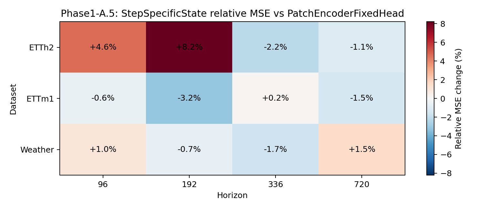
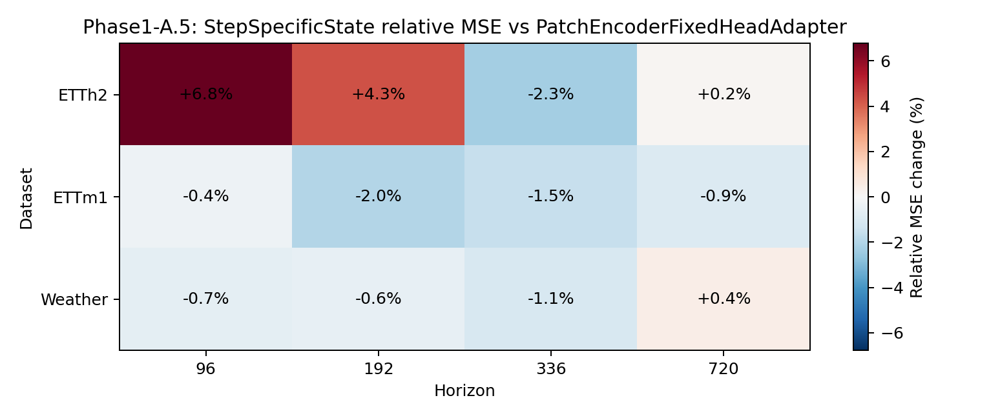

# Phase1-A.5 Step-Specific State Decoder Gate 结果报告

## 实验定位

[Fact] 本 gate 检验 `PatchEncoderStepSpecificStateAdapter` 是否能在保留 fixed-head
readout rows 的前提下，通过 readout 前的 segment-specific latent modulation 改善预测。

## 主结论

[Decision] `partial`: candidate has some signal but does not meet the full A.5 pass criteria.

## Summary

| Baseline | MSE wins | Mean Rel MSE | Range | Zero-win datasets |
| --- | ---: | ---: | --- | --- |
| PatchEncoderFixedHead | 7/12 | +0.39% | -3.15% to +8.22% | none |
| PatchEncoderFixedHeadAdapter | 8/12 | +0.19% | -2.31% to +6.77% | none |

## Diagnostics

- mean_abs_gamma: `0.604776`
- mean_abs_beta: `0.078682`
- mean segment activation cosine: `0.964393`

## Heatmaps

