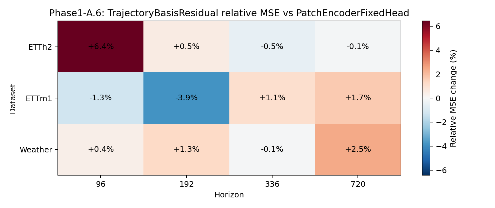
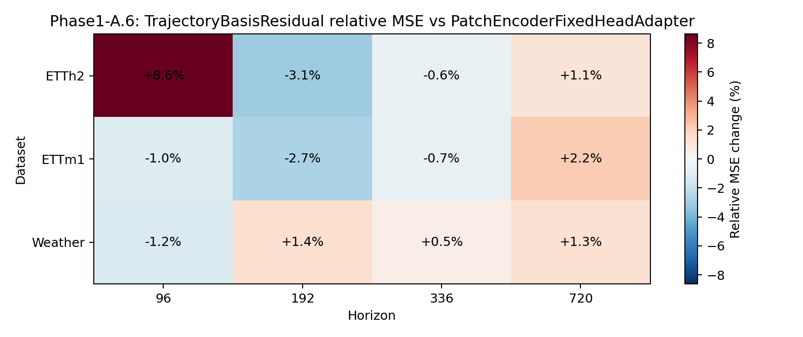
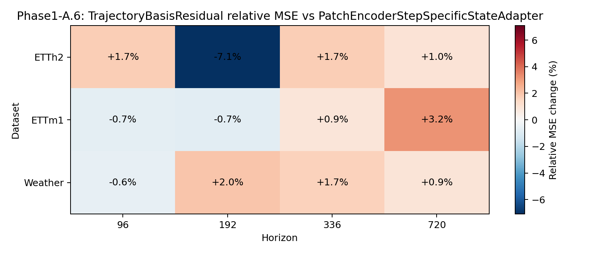

# Phase1-A.6 Trajectory Basis Residual Gate 结果报告

## 实验定位

[Fact] 本 gate 检验 `PatchEncoderTrajectoryBasisResidual` 是否能在保留 fixed-head
base trajectory 的前提下，通过 future-position low-rank residual 改善 output process。

## 主结论

[Decision] `partial`: candidate has some signal but does not meet the full A.6 pass criteria.

## Summary

| Baseline | MSE wins | Mean Rel MSE | Range | Zero-win datasets |
| --- | ---: | ---: | --- | --- |
| PatchEncoderFixedHead | 5/12 | +0.67% | -3.85% to +6.43% | none |
| PatchEncoderFixedHeadAdapter | 6/12 | +0.49% | -3.08% to +8.63% | none |
| PatchEncoderStepSpecificStateAdapter | 4/12 | +0.33% | -7.09% to +3.17% | none |

## Horizon Diagnostics

### vs PatchEncoderFixedHead

| Horizon | Wins | Mean Rel MSE |
| ---: | ---: | ---: |
| 96 | 1/3 | +1.86% |
| 192 | 1/3 | -0.68% |
| 336 | 2/3 | +0.16% |
| 720 | 1/3 | +1.33% |

### vs PatchEncoderFixedHeadAdapter

| Horizon | Wins | Mean Rel MSE |
| ---: | ---: | ---: |
| 96 | 2/3 | +2.12% |
| 192 | 2/3 | -1.47% |
| 336 | 2/3 | -0.25% |
| 720 | 0/3 | +1.56% |

### vs PatchEncoderStepSpecificStateAdapter

| Horizon | Wins | Mean Rel MSE |
| ---: | ---: | ---: |
| 96 | 2/3 | +0.16% |
| 192 | 2/3 | -1.95% |
| 336 | 0/3 | +1.42% |
| 720 | 0/3 | +1.69% |

## Residual Diagnostics

- mean residual/base MAE ratio: `0.002637`
- mean gate: `0.018039`
- mean coefficient L2: `0.292015`

## Heatmaps

