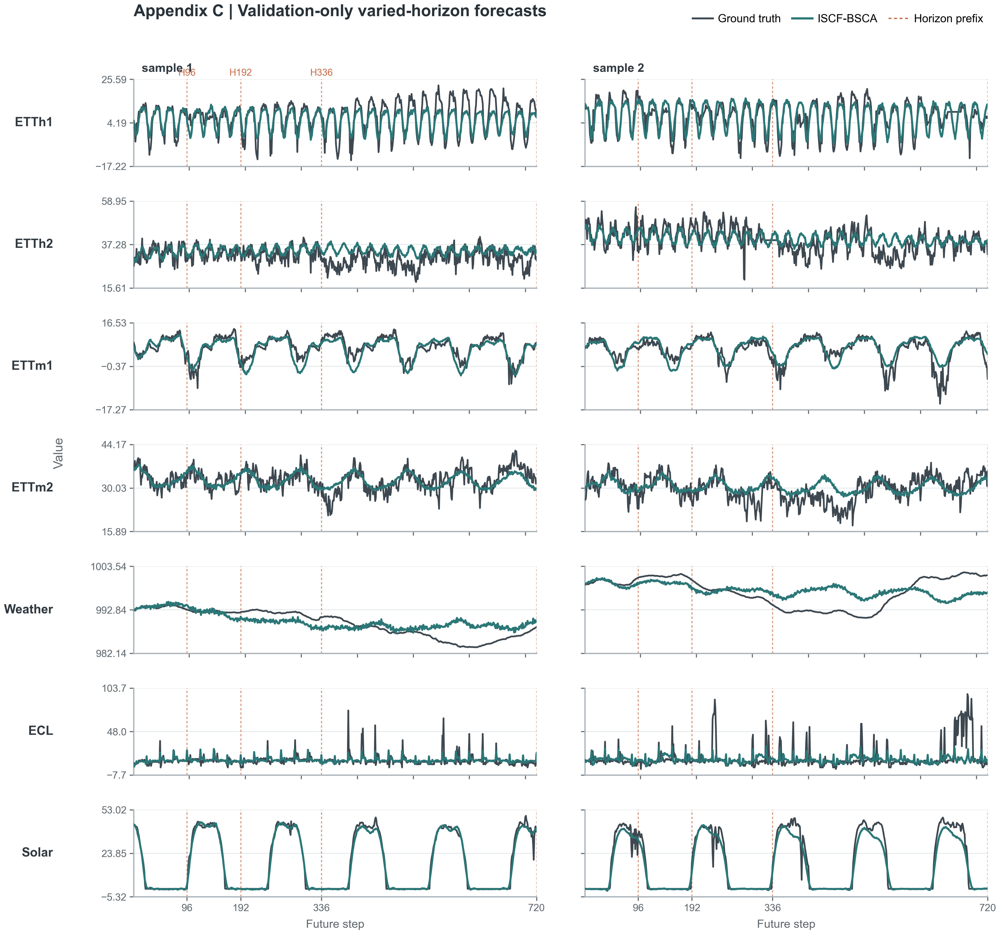

# Appendix

## A. EXPERIMENT DETAILS

### A.1 METRIC DETAILS

We use mean squared error (MSE) and mean absolute error (MAE) to evaluate forecasting accuracy. Given the ground-truth values $y_i$ and their predictions $\widehat y_i$, the two metrics are defined as

$$
\operatorname{MSE}
=
\frac{1}{N}
\sum_{i=1}^{N}
\left(y_i-\widehat y_i\right)^2,
\qquad
\operatorname{MAE}
=
\frac{1}{N}
\sum_{i=1}^{N}
\left|y_i-\widehat y_i\right|,
$$

where $N$ is the total number of scalar predictions over all evaluation windows, forecast steps and variables for the requested horizon. Lower MSE and MAE indicate more accurate forecasts.

### A.2 DATASETS

We evaluate ISCF-BSCA on seven widely used multivariate time-series forecasting datasets spanning electricity transformers, electricity consumption, meteorology and solar generation. These benchmarks differ substantially in variable dimension, sampling frequency and temporal dynamics. Table A1 summarizes their basic statistics.

1. **ETT (Electricity Transformer Temperature)** records seven load and temperature factors from two electricity transformers in two regions of China between 2016 and 2018 \citep{zhou2021informer}. We use its four standard subsets: ETTh1 and ETTh2 are sampled hourly, whereas ETTm1 and ETTm2 are sampled every 15 minutes.

2. **Electricity (ECL)** records the hourly electricity consumption of 321 clients from 2012 to 2014 and is provided by the UCI Machine Learning Repository \citep{wu2023timesnet}.

3. **Weather** is collected by the Beutenberg Weather Station at the Max Planck Institute for Biogeochemistry in Jena, Germany. It contains 21 meteorological indicators sampled every 10 minutes during 2020 \citep{wu2023timesnet}.

4. **Solar** contains solar-power measurements collected every 10 minutes from 137 photovoltaic plants in Alabama during 2006 \citep{liu2024itransformer}.

### Table A1 | Dataset Statistics

| Dataset | Variables | Sampling Frequency | Dataset Size | Domain |
| --- | ---: | --- | ---: | --- |
| ETTh1 | 7 | 1 h | (8545, 2881, 2881) | Electricity |
| ETTh2 | 7 | 1 h | (8545, 2881, 2881) | Electricity |
| ETTm1 | 7 | 15 min | (34465, 11521, 11521) | Electricity |
| ETTm2 | 7 | 15 min | (34465, 11521, 11521) | Electricity |
| ECL | 321 | 1 h | (18317, 2633, 5261) | Electricity |
| Weather | 21 | 10 min | (36792, 5271, 10540) | Weather |
| Solar | 137 | 10 min | (36601, 5161, 10417) | Solar energy |

Dataset Size is reported as (Train, Validation, Test). The ETT datasets follow their standard fixed chronological splits, whereas Weather, ECL and Solar use chronological 70/10/20 splits. The scaler is fitted exclusively on the training segment. All datasets are evaluated at prediction lengths $H\in\{96,192,336,720\}$.

### A.3 IMPLEMENTATION DETAILS

The local experiments are implemented in Python 3.12.13 and PyTorch 2.9.0 with CUDA 12.8. Each training run uses one NVIDIA GeForce RTX 3090 GPU. ISCF-BSCA is trained from scratch with AdamW and a cosine learning-rate schedule. Table A2 reports the dataset-specific optimization settings, and Table A3 lists the corresponding Encoder interface and ISCF-BSCA configuration.

### Table A2 | Training and Evaluation Settings

| Dataset | Max Length | Initial LR | Batch | Grad. Accum. | Max epochs | Patience |
| --- | ---: | ---: | ---: | ---: | ---: | ---: |
| ETTh1 | 720 | $3\times10^{-4}$ | 32 | 1 | 45 | 10 |
| ETTh2 | 720 | $5\times10^{-4}$ | 32 | 1 | 30 | 7 |
| ETTm1 | 720 | $1\times10^{-4}$ | 16 | 2 | 30 | 7 |
| ETTm2 | 720 | $5\times10^{-5}$ | 16 | 2 | 60 | 12 |
| Weather | 720 | $2\times10^{-5}$ | 32 | 1 | 120 | 24 |
| ECL | 720 | $5\times10^{-4}$ | 4 | 8 | 30 | 7 |
| Solar | 720 | $3\times10^{-4}$ | 16 | 2 | 45 | 10 |

Gradient Accumulation Steps denotes the number of mini-batches whose gradients are accumulated before one optimizer update; the effective batch size is therefore the batch size multiplied by this value. All runs use seed 2021. The checkpoint with the lowest validation mean MSE over $H\in\{96,192,336,720\}$ is retained and serves all four forecasting requests. Weight decay is $0.01$ except for ETTm2, where it is $0.001$, and early stopping uses zero minimum improvement.

### Table A3 | ISCF-BSCA Configuration

| Dataset | Scope set | Mode rank | Patch number | $d_{\mathrm{model}}$ | $d_{\mathrm{ff}}$ | Dropout | Weight decay | $\lambda_{\mathrm{scope}}$ | $\lambda_{\mathrm{balance}}^{\max}$ / ramp |
| --- | --- | ---: | ---: | ---: | ---: | ---: | ---: | ---: | --- |
| ETTh1 | $\{1,48,144,360,720\}$ | 109 | 24 | 32 | 32 | 0.1 | 0.01 | 1.0 | 0.1 / 0.25 |
| ETTh2 | $\{1,48,144,360,720\}$ | 116 | 12 | 64 | 128 | 0.1 | 0.01 | 1.0 | 0.1 / 0.25 |
| ETTm1 | $\{1,48,144,360,720\}$ | 116 | 1 | 128 | 256 | 0.9 | 0.01 | 1.0 | 0.1 / 0.25 |
| ETTm2 | $\{1,48,144,360,720\}$ | 64 | 6 | 128 | 128 | 0.2 | 0.001 | 1.0 | 0.1 / 0.25 |
| Weather | $\{1,48,144,360,720\}$ | 116 | 19 | 64 | 128 | 0.0 | 0.01 | 1.0 | 0.1 / 0.25 |
| ECL | $\{1,48,144,360,720\}$ | 64 | 1 | 256 | 1,024 | 0.3 | 0.01 | 1.0 | 0.1 / 0.25 |
| Solar | $\{1,48,144,360,720\}$ | 128 | 4 | 256 | 256 | 0.3 | 0.01 | 1.0 | 0.1 / 0.25 |

The scope set and BSCA coefficients are shared across datasets. Specifically, $\lambda_{\mathrm{scope}}=1$ and $\lambda_{\mathrm{balance}}(u)=0.1\min(u/0.25,1)$, where $u\in[0,1]$ denotes normalized optimizer progress.

## B. FULL RESULTS

Tables B1 and B2 provide the complete results for the two forecasting comparisons in Sections 5.2 and 5.3. The main text reports the four-horizon average for each dataset, whereas the appendix retains MSE and MAE at every evaluated horizon. Table B1 compares one unified ISCF-BSCA model with baselines optimized separately for each requested horizon. Table B2 places every method under the same one-model-all-horizons workflow, where shorter requests are evaluated from the corresponding prefixes of one maximum-length forecast.

<!-- Typeset insertion: analysis/iscf_bsca_paper_experiment_consolidation_20260731/main_tables_author_corrected_20260815/main_i/table_iscf_bsca_main_i_qdf.tex -->

**Table B1 | Full results for the horizon-specific comparison.** Results are reported as MSE and MAE for $H\in\{96,192,336,720\}$, and Avg. is the arithmetic mean over the four horizons. ISCF-BSCA uses one unified model per dataset, whereas the baselines follow their horizon-specific evaluation protocols. The best and second-best displayed values are highlighted in bold and underlined, respectively.

<!-- Typeset insertion: analysis/iscf_bsca_paper_experiment_consolidation_20260731/main_tables_author_corrected_20260815/main_ii/table_iscf_bsca_main_ii.tex -->

**Table B2 | Full results for the one-model-all-horizons comparison.** Each method uses one maximum-horizon model per dataset, and the shorter horizons are evaluated from the corresponding output prefixes. Results are reported as MSE and MAE, and Avg. denotes the arithmetic mean over $H\in\{96,192,336,720\}$. The best and second-best displayed values are highlighted in bold and underlined, respectively.

## C. VISUALIZATION

Figure C1 presents supplementary varied-horizon forecasting examples for the seven paper-core datasets. For each dataset, two validation samples show the ground-truth future and the fused ISCF-BSCA prediction over the maximum target length $T=720$. The paired rulers and vertical guides mark the four supported prediction lengths, showing how the same predicted trajectory provides the prefixes requested at $H\in\{96,192,336,720\}$.

**Figure C1 | Visualization of varied-horizon forecasts across seven datasets.** The dark curve denotes the ground truth and the teal curve denotes the prediction from the frozen unified ISCF-BSCA model. Two validation examples are shown for each dataset. The paired rulers and vertical guides identify the four supported prediction lengths.
