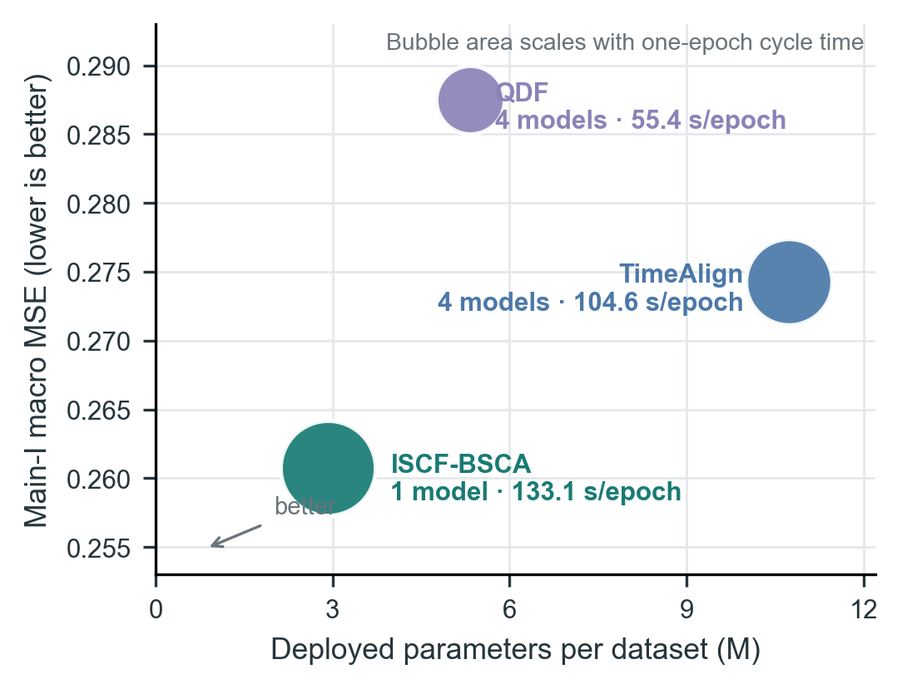
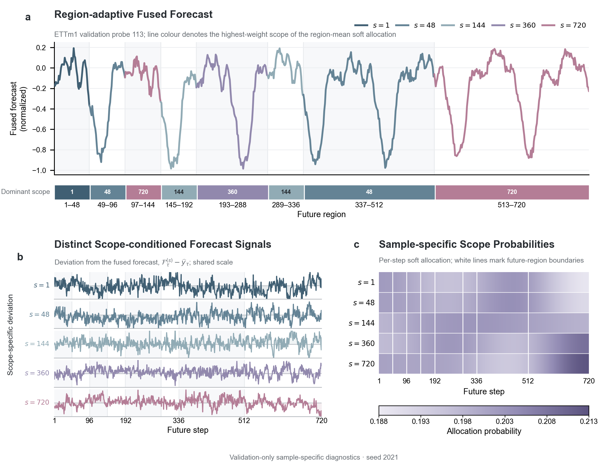
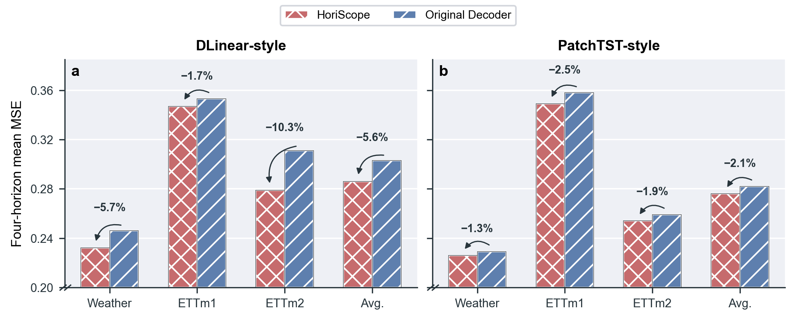

# ISCF-BSCA Section 5: Experiments

## Draft status

| Field | Content |
| --- | --- |
| `document_role` | Clean manuscript-facing initial draft of Section 5 |
| `version` | `v0.13-section5-6-author-refinement` |
| `date` | `2026-08-24` |
| `review_status` | `Figure 5 v5.3 remains temporarily fixed as manuscript-usable; Section 5.6 v0.13 incorporates the author-requested concise claim presentation; remaining Section 5 text unchanged` |
| `upstream_dependency` | Introduction v0.9, Related Work v0.2, Section 3 v0.7 and Section 4 v0.7 remain temporarily frozen and unchanged |
| `evidence_scope` | Main-I, Main-II, Efficiency, Core-Ablation, Figure 5 sample-specific scope/allocation diagnostics and author-refined Decoder-Transfer |
| `experiment_change` | None; the prose is refined from the latest frozen result artifacts, with no new training or formal test |
| `claim_boundary` | Main tables establish system-level effectiveness; matched ablations establish aggregate component utility; Figure 5 illustrates non-identical Scope-conditioned Forecasts and region-dependent soft allocation in one disclosed validation example, but not prevalence, sparse routing, oracle scope recovery or causal specialization; transfer claims are restricted to two evaluated backbone families and three reported datasets |
| `narrative_spine` | evaluation contract → horizon-specific comparison → one-model capability → system-cost trade-off → matched attribution → scope/allocation behavior → bounded generalization study |

The status table and artifact map below are editorial metadata and are not part of the manuscript body submitted for review.

## Canonical artifact map

| Manuscript item | Canonical artifact |
| --- | --- |
| Table 1 | `analysis/iscf_bsca_paper_experiment_consolidation_20260731/main_tables_author_corrected_20260815/main_i/table_iscf_bsca_main_i_dataset_average.tex` |
| Table 2 | `analysis/iscf_bsca_paper_experiment_consolidation_20260731/main_tables_author_corrected_20260815/main_ii/table_iscf_bsca_main_ii_dataset_average.tex` |
| Appendix Table B1 | `analysis/iscf_bsca_paper_experiment_consolidation_20260731/main_tables_author_corrected_20260815/main_i/table_iscf_bsca_main_i_qdf.tex` |
| Appendix Table B2 | `analysis/iscf_bsca_paper_experiment_consolidation_20260731/main_tables_author_corrected_20260815/main_ii/table_iscf_bsca_main_ii.tex` |
| Figure 6 numerical source (not inserted as a main-text table) | `analysis/iscf_bsca_paper_experiment_consolidation_20260731/efficiency_accuracy_memory_storage_20260817/table/table_iscf_bsca_efficiency.tex` |
| Table 3 | `analysis/iscf_bsca_paper_experiment_consolidation_20260731/core_ablation_20260814/formal_results/table/table_iscf_bsca_core_ablation.tex` |
| Figure 5 | `paper-figures/figure_5_scope_allocation_behavior.*` |
| Figure 6 | `paper-figures/figure_6_accuracy_system_cost.*` |
| Figure 7 numerical source (not inserted as a main-text table) | `analysis/iscf_bsca_paper_experiment_consolidation_20260731/decoder_transfer_three_dataset_scope_20260816/table_decoder_transfer_three_dataset_framework.tex` |
| Figure 7 | `paper-figures/figure_7_decoder_transfer.*` |

## 5. Experiments

ISCF-BSCA is designed to replace separately optimized horizon-specific predictors with one prefix-consistent forecaster. The central empirical question is whether a single model can serve all requested horizons without sacrificing forecasting accuracy. We examine this question through benchmark comparisons and deployment costs, and then use controlled ablations and validation diagnostics to identify the contribution and behavior of the proposed components.

### 5.1 Experimental setup

**Datasets and metrics.** We evaluate ISCF-BSCA on seven public multivariate forecasting benchmarks: ETTm1, ETTm2, ETTh1, ETTh2, Weather, Electricity (ECL) and Solar. Together, they cover electricity transformers, meteorology, electricity consumption and solar generation at different sampling frequencies and variable dimensions. Following the standard long-term forecasting protocol, we use prediction horizons $\mathcal H=\{96,192,336,720\}$ and report mean squared error (MSE) and mean absolute error (MAE), where lower values indicate better forecasts. Further dataset descriptions, statistics, data splits and preprocessing details are provided in Appendix A (Tables A1--A3).

**Model and baselines.** ISCF is a decoder framework that can be coupled with different Encoders. To focus the main experiments on the proposed decoder rather than a highly specialized history backbone, we pair ISCF with a lightweight patch-token MLP Encoder. To compare its forecasting performance against recent competitive methods, we select baselines from four dominant design families: (1) Transformer-based models, including SimpleTM, iTransformer, PatchTST and Crossformer; (2) lightweight linear or attention-based forecasters and training frameworks, including TimeAlign, QDF and DLinear; (3) convolutional models, including TVNet, ModernTCN and TimesNet; and (4) multi-scale or decomposition-based models, including AMD, TimeMixer and Leddam.

**Evaluation protocols.** We use two complementary comparisons. The first compares one ISCF-BSCA model per dataset with horizon-specific baselines that train a separate model for each requested horizon. It tests whether one unified predictor can replace four separately trained horizon-specific models while remaining competitive with horizon-wise optimization. The second evaluates every method under a one-model setting: each method uses one unified model trained for the maximum horizon, and an $H$-step request is evaluated from the first $H$ outputs using the corresponding official fixed-$H$ test loader.

**Implementation details.** Local experiments are implemented in Python 3.12.13 and PyTorch 2.9.0 with CUDA 12.8, and run on NVIDIA GeForce RTX 3090 GPUs. ISCF-BSCA is optimized with AdamW and a cosine learning-rate schedule; the learning rate, batch size, model width and training budget are configured per dataset. All locally reproduced baselines are built from their official codebases, and any source-informed configuration adaptation is documented explicitly.

### 5.2 Comparison with horizon-specific forecasters

The first comparison asks whether one unified forecaster can match baselines optimized separately for each requested horizon. ISCF-BSCA uses one model per dataset to produce all four forecasts, whereas each baseline entry in Table 1 follows its native horizon-specific protocol.

<!-- Insert Table 1 near here. Main-text source: main_i/table_iscf_bsca_main_i_dataset_average.tex. Full horizon-wise source: main_i/table_iscf_bsca_main_i_qdf.tex (Appendix B). -->

Table 1 reports the four-horizon mean for each dataset, while the complete horizon-wise results are provided in Appendix B. ISCF-BSCA obtains the best result in 13 of the 14 dataset--metric comparisons and the second-best result in the remaining comparison. Compared with TimeAlign, the strongest aggregate horizon-specific baseline, ISCF-BSCA uses one unified model instead of four separately trained horizon models and reduces the seven-dataset average MSE and MAE by 4.94% and 2.54%, respectively. The advantage persists across datasets with markedly different dimensionalities. Over the four low-dimensional ETT benchmarks, ISCF-BSCA improves the average MSE and MAE over TimeAlign by 5.69% and 2.89%; on the high-dimensional ECL and Solar datasets, the corresponding improvements are 3.90% and 2.27%. Notably, these results are obtained with a lightweight patch-token MLP Encoder rather than a specialized high-capacity backbone, indicating that the ISCF decoder can construct accurate future trajectories from comparatively shallow history representations. Overall, the results show that ISCF-BSCA improves forecasting accuracy over the evaluated horizon-specific baselines while consolidating the four requested horizons into one model.

### 5.3 One-model-all-horizons evaluation

The preceding comparison showed that one unified ISCF-BSCA model can outperform baselines that train a separate model for each of the four horizons. We next place every method under the same one-model-all-horizons workflow. For each dataset, a single model produces the maximum-length forecast, and requests for $H\in\{96,192,336\}$ are evaluated from the corresponding output prefixes without retraining or reselection. This setting maintains consistency across overlapping predictions within each method and provides a more deployment-relevant comparison without horizon-specific model specialization.

<!-- Insert Table 2 near here. Main-text source: main_ii/table_iscf_bsca_main_ii_dataset_average.tex. Full horizon-wise source: main_ii/table_iscf_bsca_main_ii.tex (Appendix B). -->

Table 2 summarizes the four-horizon mean for each dataset, with complete horizon-wise results provided in Appendix B. Under the shared one-model constraint, ISCF-BSCA ranks first in all 14 dataset--metric comparisons. Averaged over all seven datasets and four horizons, it reduces MSE and MAE by 6.45% and 3.72% relative to TimeAlign, the next strongest complete baseline in Table 2. These gains exceed the corresponding 4.94% and 2.54% improvements in the horizon-specific comparison by 1.51 and 1.18 percentage points, respectively, showing that the advantage of ISCF-BSCA becomes more pronounced when every method follows the same unified forecasting workflow.

These results establish ISCF-BSCA as an effective forecaster for unified multi-horizon prediction. Its scope-indexed forecast field constructs one prefix-consistent trajectory, while Target-Adaptive Scope Allocation integrates predictive information across different sharing granularities for each future step. The consistently strong results across the four evaluated horizons support this output-side design for forecasting requests ranging from short to long endpoints.

### 5.4 Accuracy and system cost

Forecast accuracy is only one consideration in practical forecasting services. Runtime memory and model storage also determine deployment and management costs, particularly in resource-constrained settings. We therefore measure the peak allocated GPU memory of the complete inference service and the total checkpoint storage required to serve all four horizons. Figure 6 compares forecasting accuracy with these two costs. ISCF-BSCA uses one unified checkpoint per dataset, whereas each baseline retains four horizon-specific model instances.

**Figure 6 | Accuracy and system cost for four-horizon forecasting.** Macro MSE is plotted against total checkpoint storage, and bubble area represents peak allocated inference memory. ISCF-BSCA uses one unified checkpoint, whereas each baseline uses four horizon-specific models. The storage axis is logarithmic; lower-left positions indicate a more favorable trade-off.

As shown in Figure 6, ISCF-BSCA attains the lowest macro MSE among the eight displayed methods, at 0.261, while requiring 17.677 MiB of checkpoint storage and 38.817 MiB of peak allocated inference memory. Compared with TimeAlign, AMD, iTransformer, PatchTST and TimeMixer, the unified model reduces checkpoint storage by 30.12--92.01% and peak memory by 18.01--83.69%. Relative to TimeAlign in particular, ISCF-BSCA lowers MSE by 4.94%, checkpoint storage by 81.48% and peak memory by 64.42%.

By consolidating four forecasting horizons into one model, ISCF-BSCA achieves a favorable balance between accuracy, runtime memory and checkpoint storage. It is not the lightest method on every resource dimension, as DLinear and QDF retain lower values on at least one cost measure, but it combines the best forecasting accuracy with substantially lower resource footprints than several competitive baselines. This balance makes the unified architecture attractive for practical forecasting services in which predictive quality and model-management cost must be considered together.

### 5.5 Component and training-objective ablations

The preceding experiments establish the overall effectiveness of ISCF-BSCA. To determine whether its individual components contribute to this performance, we conduct strictly controlled ablations in which each variant is trained end to end under the same protocol. **w/o BSCA** retains the Uniform-Prefix Forecasting Loss but removes the Scope-Wise Forecasting Loss and Allocation-Balance Regularizer. **w/o Target-Adaptive Allocation** replaces learned Scope Probabilities with equal non-adaptive fusion. **Shared Scope Projection** replaces the scope-specific history projections with one shared projection, whereas **Fixed Scope ($s=144$)** retains only the preregistered middle scope.

<!-- Insert Table 3 near here. Canonical source: core_ablation/table/table_iscf_bsca_core_ablation.tex -->

As reported in Table 3, Full ISCF-BSCA achieves a five-dataset macro MSE/MAE of 0.305/0.344 and ranks first in all 12 dataset and average metric columns. Removing BSCA produces the largest aggregate degradation, increasing MSE and MAE by 3.48% and 2.83%. Equal fusion yields 0.310/0.349, corresponding to gains of 1.61% in MSE and 1.43% in MAE from Target-Adaptive Allocation. Shared Scope Projection and Fixed Scope yield MSE values of 0.314 and 0.315, respectively, compared with 0.305 for the complete model. Full ISCF-BSCA improves both metrics over every control on all five datasets.

Together, these controlled comparisons show that each evaluated component contributes to the complete model. BSCA improves joint optimization across the scope lines. Target-Adaptive Scope Allocation outperforms equal fusion, while scope-specific projections and multi-scope generation improve upon their shared-projection and fixed-scope counterparts. Their combination yields the strongest overall performance.

### 5.6 Scope diversity and allocation behavior

The ablation results establish the contribution of the individual ISCF-BSCA components to forecasting accuracy. We next examine whether the internal behavior of the complete model follows the intended design. Specifically, we ask whether the jointly trained scope lines retain distinct scope-dependent forecast signals and whether the Target-Adaptive Allocation Path produces diverse scope preferences across future regions. Together, these properties determine whether ISCF can synthesize region-specific forecasts from multiple sharing granularities rather than collapsing to repeated scope trajectories and a fixed allocation pattern.

We first extract the region-wise predictions from each scope line and concatenate them into a complete Scope-conditioned Forecast. Directly overlaying the five trajectories obscures their differences, so Figure 5b visualizes each Scope-conditioned Forecast relative to the fused trajectory, $\mathcal F_\tau^{(s)}-\widehat y_\tau$. The resulting profiles exhibit distinct temporal structures, with a mean pairwise absolute disagreement of 0.0812 on the normalized scale. The scope-indexed forecast field therefore retains distinct candidate signals for region-wise integration rather than collapsing to five repeated trajectories.

We next examine how the Target-Adaptive Allocation Path combines these heterogeneous scope signals. Figure 5a colours the fused maximum-horizon forecast by the scope receiving the highest mean Scope Probability within each future region. All five scopes become the highest-weight component in at least one of the eight regions, showing that the allocation does not reduce to one fixed regional preference. Figure 5c further displays the complete per-step Scope Probabilities, whose relative ordering varies across future steps and regions rather than remaining identical throughout the future domain. Notably, the farthest region assigns its highest mean weight to the largest sharing scope, $s=720$. This sample-level observation is consistent with the intuition that distal forecasting can benefit from broader information sharing. Together, the three panels show how distinct scope signals and region-dependent soft allocation support region-specific forecast synthesis. These behaviors operate within one shared prediction trajectory: prefix-based inference guarantees CHPC, and the frozen implementation yields a maximum absolute CHPD of 0 in all 20 dataset--horizon checks.

**Figure 5 | Scope diversity and sample-specific allocation behavior in ISCF-BSCA.** All panels use ETTm1 validation probe 113. The probe was selected from 1,280 candidates by first maximizing regional dominant-scope diversity and then maximizing mean pairwise scope-forecast disagreement. **a**, The actual fused forecast; line colour and the lower strip identify the highest-weight scope after averaging Scope Probabilities within each future region. This encoding summarizes a soft allocation rather than a hard route. **b**, Deviations of the five Scope-conditioned Forecasts from the fused forecast on a shared scale. **c**, Per-step Scope Probabilities for the same probe; white lines mark future-region boundaries. The panels are validation-only diagnostics from seed 2021 and illustrate a selected example rather than population prevalence, oracle scope recovery or causal specialization.

### 5.7 Generalization studies

ISCF is designed as an Encoder-agnostic plug-in decoder: it operates on an Encoder-produced history representation rather than relying on a particular history-modeling architecture. We examine this versatility using DLinear and PatchTST as representatives of lightweight linear and Transformer-based Encoders, respectively. For each backbone, we replace the Original Decoder with the complete ISCF-BSCA framework and train the resulting model end to end. The comparison covers Weather, ETTm1 and ETTm2, and each displayed value averages MSE over the four horizons.

**Figure 7 | Generalization across two forecasting backbones.** Four-horizon mean MSE is reported for **a**, DLinear and **b**, PatchTST with either the Original Decoder or ISCF-BSCA. Percentages denote the relative MSE change, and Avg. is the mean over Weather, ETTm1 and ETTm2. The MSE axis begins at 0.20 to resolve paired differences.

As shown in Figure 7, replacing the Original Decoder with ISCF-BSCA improves forecasting performance on both example backbones. For DLinear, the replacement lowers MSE on all three datasets and reduces the macro average from 0.303 to 0.286, corresponding to an improvement of 5.61%. PatchTST shows smaller but consistent gains, with macro MSE decreasing from 0.282 to 0.276, corresponding to an improvement of 2.13%. The improvements obtained with both a lightweight linear backbone and a Transformer-based backbone show that ISCF-BSCA is not tied to a single Encoder design, supporting its intended role as a general plug-in decoder for unified multi-horizon forecasting.

## Editorial evidence and claim audit

| Subsection | Evidence status | Permitted claim | Prohibited promotion |
| --- | --- | --- | --- |
| 5.2 Main-I | Complete seven-dataset, four-horizon table with mixed source roles | One unified ISCF-BSCA model is more accurate on most cells than separately optimized horizon-specific baselines | Matched decoder attribution or untouched-holdout generalization |
| 5.3 Main-II | Complete source-native one-model table | One ISCF-BSCA checkpoint serves all evaluated horizons competitively | Fully matched architecture comparison across all baselines |
| 5.4 Efficiency | Complete Figure 6 source with audited accuracy and memory/storage service units | Lowest macro MSE among the eight displayed methods and one-checkpoint consolidation; lower memory/storage than TimeAlign, AMD, iTransformer, PatchTST and TimeMixer | Uniform memory/storage advantage or a training-time claim |
| 5.5 Core ablation | Author-corrected five-dataset aggregate table | All four interventions improve aggregate MSE/MAE under the matched design | Per-horizon dominance, oracle routing or independently verified component semantics |
| 5.6 Scope diversity and allocation behavior | Complete five-dataset validation diagnostic bundle; one probe is selected by a disclosed 1,280-candidate audit | In the selected example, Scope-conditioned Forecasts are non-identical and the dominant component of the soft allocation varies by future region; numerical CHPC holds | Population prevalence, sparse routing, oracle scope recovery, hard routing or causal specialization |
| 5.7 Generalization studies | Complete Figure 7 MSE source for two backbones and three datasets | Complete-framework compatibility across the two displayed backbone families | Universal architecture-agnostic transfer; separate ISCF/BSCA attribution |
