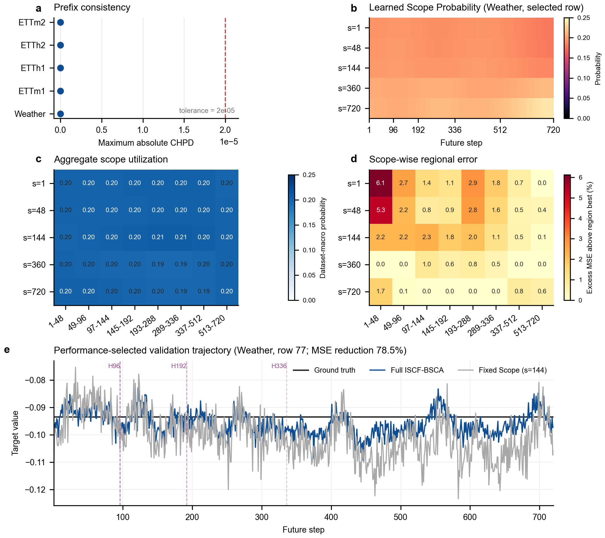

# ISCF-BSCA Section 5: Experiments

## Draft status

| Field | Content |
| --- | --- |
| `document_role` | Clean manuscript-facing initial draft of Section 5 |
| `version` | `v0.2-efficiency-redesign-synchronized` |
| `date` | `2026-08-17` |
| `review_status` | `initial_draft_pending_author_review` |
| `upstream_dependency` | Introduction v0.9, Related Work v0.2, Section 3 v0.7 and Section 4 v0.7 remain temporarily frozen and unchanged |
| `evidence_scope` | Main-I, Main-II, Efficiency, Core-Ablation, Figure 5 mechanism diagnostics and author-refined Decoder-Transfer |
| `experiment_change` | Efficiency Table 3 and Figure 6 redesigned from existing artifacts; no new training or formal test |
| `claim_boundary` | Main tables establish system-level effectiveness; matched ablations establish aggregate component utility; Figure 5 provides mixed internal-behavior evidence; transfer claims are restricted to the evaluated three-dataset scope |
| `narrative_spine` | evaluation contract → horizon-specific comparison → one-model capability → system-cost trade-off → matched attribution → internal behavior → bounded transferability |

The status table and artifact map below are editorial metadata and are not part of the manuscript body submitted for review.

## Canonical artifact map

| Manuscript item | Canonical artifact |
| --- | --- |
| Table 1 | `analysis/iscf_bsca_paper_experiment_consolidation_20260731/main_tables_author_corrected_20260815/main_i/table_iscf_bsca_main_i_qdf.tex` |
| Table 2 | `analysis/iscf_bsca_paper_experiment_consolidation_20260731/main_tables_author_corrected_20260815/main_ii/table_iscf_bsca_main_ii.tex` |
| Table 3 | `analysis/iscf_bsca_paper_experiment_consolidation_20260731/efficiency_accuracy_memory_storage_20260817/table/table_iscf_bsca_efficiency.tex` |
| Table 4 | `analysis/iscf_bsca_paper_experiment_consolidation_20260731/core_ablation_20260814/formal_results/table/table_iscf_bsca_core_ablation.tex` |
| Figure 5 | `paper-figures/figure_iscf_bsca_mechanism.*` |
| Figure 6 | `paper-figures/figure_6_accuracy_system_cost.*` |
| Table 5 | `analysis/iscf_bsca_paper_experiment_consolidation_20260731/decoder_transfer_three_dataset_scope_20260816/table_decoder_transfer_three_dataset_framework.tex` |
| Figure 7 | `paper-figures/figure_7_decoder_transfer.*` |

## 5. Experiments

We evaluate ISCF-BSCA along seven complementary dimensions. The main comparisons first ask whether one unified model can replace separately optimized horizon-specific systems and whether it remains competitive when every method must serve all horizons from one checkpoint. We then measure the resulting system cost, isolate the contributions of the architecture and training objective, examine whether the learned system satisfies CHPC and exhibits the future-region behavior motivated in Section 3, and finally assess whether the complete decoder transfers to different forecasting backbones.

### 5.1 Experimental setup

**Datasets and metrics.** We conduct the main evaluation on seven public multivariate forecasting benchmarks: ETTm1, ETTm2, ETTh1, ETTh2, Weather, Electricity (ECL) and Solar. These datasets cover electricity transformers, meteorology, electricity consumption and solar generation, with different sampling frequencies, sequence lengths and numbers of variables. Following the standard long-term forecasting protocol, we evaluate prediction horizons $\mathcal H=\{96,192,336,720\}$ and report mean squared error (MSE) and mean absolute error (MAE), where lower values indicate better forecasts. Dataset splits and normalization follow the source protocols used by the corresponding systems.

**Evaluation protocols.** We separate two system-level comparisons because they answer different questions. Main-I compares one ISCF-BSCA model per dataset with conventional systems that train a separate model for each horizon. Main-II instead requires every system to use one model trained for $H=720$ and evaluates the prefixes of that model at all four horizons. Main-I therefore measures whether a unified forecaster can replace a horizon-specific model family, whereas Main-II directly compares one-model-all-horizons services. The external baselines include linear, patch-based, inverted-token, multi-scale and recent state-of-the-art forecasters. Their results retain their audited source-native or published roles; consequently, the main tables are system-level comparisons rather than matched architectural ablations.

**Training and model selection.** ISCF-BSCA uses one checkpoint per dataset and the primary seed 2021. Checkpoints within each training trial are selected on the validation split using the mean MSE over the four horizons. Dataset-level hyperparameter profiles are then selected by the preregistered mean official-test MSE over the same horizon set, without horizon-, seed-, metric- or cell-specific selection. The resulting benchmark is therefore explicitly test-informed and test-tuned rather than an untouched-holdout evaluation. All attempted profiles and negative cells are retained in the experiment record. External systems preserve their native optimization, checkpoint and seed protocols, and these source differences are reported with the full settings in Appendix A.

**Matched and diagnostic evaluations.** The ablation study uses the exact ISCF-BSCA-v1 anchor and matched end-to-end controls on ETTm1, ETTm2, ETTh1, ETTh2 and Weather. Decoder-transfer experiments train the Original Decoder and complete ISCF-BSCA framework end to end under the same backbone block. Internal-behavior analyses use validation artifacts only and are not used to establish test accuracy. For the efficiency comparison, Main-I accuracy is paired with fresh-process RTX 3090 peak allocated memory and complete four-horizon checkpoint storage. Actual trained files are used where the complete inventory exists; four additional baseline families use official-configuration architecture-equivalent state-dict serialization and are disclosed separately.

### 5.2 Comparison with horizon-specific forecasters

The first experiment asks whether one unified forecaster can compete with systems separately optimized for each requested horizon. ISCF-BSCA uses one model per dataset to produce all four predictions, whereas every baseline entry in Table 1 corresponds to its native horizon-specific system. This comparison therefore places the proposed unified service against the accuracy advantage available to four independently trained models.

<!-- Insert Table 1 near here. Canonical source: main_i/table_iscf_bsca_main_i_qdf.tex -->

Table 1 shows that ISCF-BSCA achieves the best value in 44 of the 56 dataset-horizon metric cells and the second-best value in another nine. Its macro MSE and MAE over the seven datasets and four horizons are 0.2607 and 0.3061. Relative to TimeAlign, the strongest complete horizon-specific reference in the audited local block, ISCF-BSCA reduces macro MSE and MAE by 4.94% and 2.54%, respectively; the corresponding reductions relative to QDF are 9.32% and 7.64%. The gains are particularly consistent on ETTh2 and Weather, where the unified model attains the lowest MSE and MAE at every horizon.

The remaining cells delimit the result. ISCF-BSCA is outside the top two for MSE on ECL and Solar at $H=720$, and for MAE on ETTh1 at $H=336$. Moreover, Table 1 combines audited local reproductions with published-context results and does not align all optimization budgets or seeds. The evidence therefore supports a system-level conclusion: one ISCF-BSCA model can replace four separately optimized forecasters while remaining more accurate on the large majority of evaluated cells. It does not by itself attribute this advantage to a particular decoder component.

### 5.3 One-model-all-horizons evaluation

Main-I compares different deployment structures. To isolate one-model serving capability more directly, Main-II applies the same service constraint to every method. For each dataset, one $H=720$ model is retained and an $H$-step request is evaluated from its first $H$ outputs using the system's official fixed-$H$ test loader. No model is retrained or reselected for the shorter horizons.

<!-- Insert Table 2 near here. Canonical source: main_ii/table_iscf_bsca_main_ii.tex -->

Under this protocol, ISCF-BSCA records the best value in 50 of 56 metric cells and the second-best value in the remaining six, so every displayed result lies within the top two. It is best for both metrics throughout ETTm1, ETTh1, ETTh2 and Weather. The second-best cells are confined to MSE on ETTm2 at $H\in\{192,336\}$, ECL at $H=720$ and Solar at $H\in\{336,720\}$, together with MAE on ECL at $H=720$. Across all cells, ISCF-BSCA reduces macro MSE and MAE by 6.45% and 3.72% relative to TimeAlign, the next strongest complete system in this table.

These results strengthen the practical case for varied-horizon forecasting: one ISCF-BSCA checkpoint serves all evaluated endpoints without sacrificing the accuracy available from competing one-model systems. The comparison remains source-native rather than fully matched, and several baselines obtain nested outputs by slicing a single $H=720$ forecast. Main-II therefore establishes one-model-all-horizons effectiveness, while the architectural distinction of ISCF-BSCA lies in constructing the future-step-indexed trajectory and its sharing structure explicitly.

### 5.4 Accuracy and system cost

Replacing a four-model family changes both forecast accuracy and deployment-system cost. Table 3 jointly reports the Main-I macro MSE/MAE, peak GPU memory for a complete four-horizon inference service, and the total checkpoint storage needed by that service. ISCF-BSCA contributes one unified model per dataset, whereas each of the eight baselines contributes four native fixed-horizon models.

<!-- Insert Table 3 near here. Canonical source: efficiency_accuracy_memory_storage_20260817/table/table_iscf_bsca_efficiency.tex -->

**Figure 6 | Accuracy--storage trade-off for four-horizon forecasting services.** Vertical position shows macro MSE over seven datasets and four horizons; horizontal position shows the complete four-horizon checkpoint storage on a logarithmic scale; bubble area is proportional to peak allocated inference memory. ISCF-BSCA stores one unified checkpoint, whereas each baseline represents four horizon-specific models. Resource footprints for DLinear, iTransformer, PatchTST and TimeMixer use official-configuration architecture-equivalent state dicts because complete trained checkpoint inventories are unavailable. SimpleTM is omitted from this visualization under the author-specified display scope but remains reported in the complete Table 3. Lower-left positions indicate a more favorable accuracy--storage trade-off; the figure does not establish a uniform resource advantage.

ISCF-BSCA attains the lowest macro MSE/MAE, 0.261/0.306, among the nine systems. Its complete service uses 38.817 MiB peak allocated GPU memory and 17.677 MiB of checkpoint storage. Relative to TimeAlign and AMD, the unified service reduces peak memory by 64.42% and 83.69% and checkpoint storage by 81.48% and 92.01%, respectively. It also reduces both costs relative to iTransformer, PatchTST and TimeMixer, with peak-memory reductions of 18.01%, 45.79% and 27.34% and storage reductions of 50.10%, 30.12% and 52.46%.

The expanded comparison also exposes an important boundary. DLinear and SimpleTM remain substantially lighter: DLinear has the lowest peak memory at 13.111 MiB, while SimpleTM has the lowest storage at 2.835 MiB; QDF also has lower peak memory than ISCF-BSCA. Peak memory is measured in a fresh process on an exclusive RTX 3090 in FP32 with batch size 1, synthetic standardized inputs and all service models resident. DLinear, iTransformer, PatchTST and TimeMixer use official-configuration architecture-equivalent state dicts because complete trained checkpoint inventories are unavailable, so their storage values describe architecture-equivalent service footprints rather than completed training artifacts. The evidence supports one-checkpoint consolidation and a favorable accuracy--resource trade-off against several stronger or larger families, but not a uniform resource advantage over every lightweight baseline.

### 5.5 Component and training-objective ablations

We next isolate the design choices within a matched end-to-end setting. Table 4 compares the complete model with four author-fixed controls. **w/o BSCA** retains the Uniform-Prefix Forecasting Loss but removes the Scope-Wise Forecasting Loss and Allocation-Balance Regularizer. **w/o Target-Adaptive Allocation** replaces learned Scope Probabilities with equal non-adaptive fusion. **Shared Scope Projection** removes scope-specific history information pools, while **Fixed Scope ($s=144$)** retains only the preregistered middle scope; $s=144$ is a budget-aware control rather than a searched optimum.

<!-- Insert Table 4 near here. Canonical source: core_ablation/table/table_iscf_bsca_core_ablation.tex -->

The complete model obtains a five-dataset mean MSE/MAE of 0.305/0.344 and is best in all 12 dataset and average metric columns. Removing BSCA increases the mean to 0.316/0.354, corresponding to relative degradations of 3.48% in MSE and 2.83% in MAE. Equal fusion produces 0.310/0.349, so Target-Adaptive Allocation contributes reductions of 1.61% and 1.43%. Sharing the Scope Projection yields 0.314/0.351, while the fixed-scope control yields 0.315/0.351; the full model reduces their MSE by 2.87% and 3.17%, respectively. Each direction holds for both metrics on all five displayed datasets.

The ablations establish four aggregate roles. BSCA improves the joint optimization of the scope field and allocator; target-adaptive weighting is more effective than equal fusion; independent Scope Projections preserve useful granularity-specific history information; and combining multiple scopes is preferable to the middle fixed scope. The table reports four-horizon dataset means, and the corrected aggregate record does not provide a newly synchronized per-horizon checkpoint audit. We therefore restrict the conclusion to aggregate component utility rather than claiming that every intervention improves every individual horizon or that the learned probabilities recover an oracle scope.

### 5.6 Forecast consistency and scope-allocation behavior

The preceding tables establish accuracy, but they do not show whether the trained system behaves according to the two motivations developed in Section 3. Figure 5 therefore examines three distinct questions using validation artifacts: whether CHPC holds numerically, whether scope-conditioned forecasts exhibit region-dependent error, and how the learned Scope Probabilities relate to that error structure. These diagnostics are deliberately separated from test-set effectiveness.

**Figure 5 | Forecast consistency, scope-allocation behavior and an illustrative trajectory.** **a**, Maximum absolute CHPD for the four supported horizons on ETTm1, ETTm2, ETTh1, ETTh2 and Weather; all 20 dataset-horizon comparisons equal zero and remain below the numerical tolerance. **b**, Scope Probabilities across 720 future steps for the performance-selected Weather validation row. **c**, Dataset-macro Scope Probability in eight future regions. **d**, Excess scope-wise regional MSE above the best scope in each region, averaged equally over the five datasets. **e**, Ground truth and forecasts from Full ISCF-BSCA and Fixed Scope ($s=144$) on Weather validation row 77. The example was selected from all 1,280 aligned validation rows by the largest $H=720$ MSE reduction of Full over Fixed Scope and is illustrative rather than representative; dashed markers indicate the shorter prefix endpoints.

Figure 5a verifies the system contract directly. Across five datasets and four horizons, the maximum absolute CHPD is exactly zero in all 20 comparisons, below the predefined tolerance of $2\times10^{-5}$. Thus, changing the requested endpoint leaves every shared future prediction unchanged in the implemented inference graph. This result confirms numerical CHPC but is independent of forecast accuracy.

The allocation diagnostics reveal a more nuanced mechanism. All five scopes remain active, yet their dataset-region mean probabilities occupy a narrow range from 0.1826 to 0.2148 (Figure 5b,c), indicating distributed rather than sparse specialization. In contrast, the scope-conditioned forecasts show clear regional error differences. The lowest-error scope changes across the eight future regions, and the largest macro best-to-worst excess MSE reaches 6.123% (Figure 5d). These results support the existence of region-dependent scope utility within the trained field, consistent with the sharing-demand heterogeneity identified in Section 3.

However, high probability does not consistently identify the lowest-error scope: the highest-utilization scope matches the regional MSE winner in only 8 of 40 dataset-region cells. This observation does not contradict the positive aggregate allocation ablation in Table 4. Equal fusion removes the complete target-adaptive weighting process, whereas a region-wise winner test asks whether its largest probability acts as an oracle selector. Taken together, the evidence indicates that learned allocation improves aggregate forecasts while remaining soft and broadly distributed; it does not establish reliable region-best routing or semantic specialization.

Figure 5e provides a concrete illustration of the resulting forecast. On the selected Weather validation row, Full ISCF-BSCA reduces $H=720$ MSE and MAE by 78.48% and 54.39% relative to Fixed Scope ($s=144$), while its shorter outputs remain nested prefixes of the same trajectory. Because the row was deliberately chosen for the largest improvement over the fixed-scope control, it demonstrates a possible qualitative benefit but does not estimate typical gain, prevalence or the independent causal effect of allocation.

### 5.7 Backbone transferability

ISCF is designed as a decoder-side framework rather than a backbone-specific forecasting model. We therefore replace the Original Decoder of two encoder realizations—a DLinear-style decomposition backbone and a PatchTST-style contextual patch backbone—with the complete ISCF-BSCA framework and train each system end to end. The comparison uses Weather, ETTm1 and ETTm2, and every displayed dataset value averages MSE or MAE over the four horizons.

<!-- Insert Table 5 near here. Canonical source: decoder_transfer_three_dataset_scope_20260816/table_decoder_transfer_three_dataset_framework.tex -->

**Figure 7 | Transfer of the complete ISCF-BSCA framework across two forecasting backbones.** **a**, Four-horizon mean MSE for the DLinear-style backbone. **b**, Corresponding results for the PatchTST-style backbone. Each pair compares the Original Decoder with the complete ISCF-BSCA framework; percentages denote the relative MSE reduction. Avg. is the arithmetic mean over Weather, ETTm1 and ETTm2. The corrected aggregate artifacts provide point estimates rather than repeated-run uncertainty, so no error bars are shown.

For the DLinear-style backbone, ISCF-BSCA improves MSE and MAE on all three datasets and reduces their macro averages from 0.303/0.333 to 0.286/0.321, corresponding to gains of 5.61% and 3.60%. The largest MSE reduction occurs on ETTm2 at 10.3%. The PatchTST-style backbone shows smaller but consistent gains: the macro MSE/MAE decreases from 0.282/0.314 to 0.276/0.310, with improvements of 2.13% and 1.27% and positive directions on all three datasets. Across both backbones, the complete framework is better in all 16 displayed dataset and average metric comparisons.

The transfer evidence is deliberately bounded. The three-dataset reporting scope was refined after a broader audit, and earlier ETTh1, ETTh2 and iTransformer-style experiments did not show consistent improvements; these negative results are retained in Appendix C. In addition, the corrected aggregate record is not accompanied by a newly synchronized per-horizon and checkpoint manifest. Figure 7 therefore supports portability across the two evaluated backbones and three datasets, but not universal, architecture-agnostic transfer or separate attribution of the gain to ISCF and BSCA.

## Editorial evidence and claim audit

| Subsection | Evidence status | Permitted claim | Prohibited promotion |
| --- | --- | --- | --- |
| 5.2 Main-I | Complete seven-dataset, four-horizon table with mixed source roles | One unified ISCF-BSCA model is more accurate on most cells than separately optimized horizon-specific systems | Matched decoder attribution or untouched-holdout generalization |
| 5.3 Main-II | Complete source-native one-model table | One ISCF-BSCA checkpoint serves all evaluated horizons competitively | Fully matched architecture comparison across all systems |
| 5.4 Efficiency | 252/252 Main-I accuracy cells, 63/63 memory/storage service units and 231 table-role objects | Best nine-system macro accuracy and one-checkpoint consolidation; lower memory/storage than TimeAlign, AMD, iTransformer, PatchTST and TimeMixer | Uniform memory/storage advantage, treating architecture-equivalent rows as trained artifacts, or a training-time claim |
| 5.5 Core ablation | Author-corrected five-dataset aggregate table | All four interventions improve aggregate MSE/MAE under the matched design | Per-horizon dominance, oracle routing or independently verified component semantics |
| 5.6 Mechanism analysis | Complete validation diagnostic bundle | Exact CHPC, active scopes and regional scope-error heterogeneity; selected example is illustrative | Reliable region-best routing, sparse specialization, prevalence or causal interpretation of the example |
| 5.7 Decoder transfer | Author-refined two-backbone, three-dataset aggregate table | Complete-framework portability within the displayed scope | Universal or architecture-agnostic transfer; separate ISCF/BSCA attribution |
