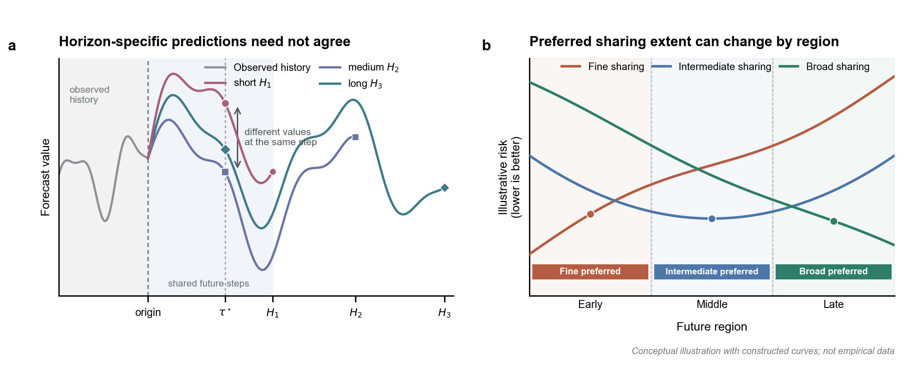

# ISCF-BSCA Introduction: Initial Manuscript Draft

## Draft status

| Field | Content |
| --- | --- |
| `document_role` | Clean manuscript-facing draft of the Introduction |
| `version` | `v0.9-author-refinement` |
| `highlighted_review` | `docs/paper-drafts/iscf-bsca-introduction-v0.9-highlighted-review.md` |
| `date` | `2026-07-30` |
| `paragraphs_1_6` | Compact manuscript-facing core narrative with one conceptual figure |
| `citation_status` | Provisional citation keys inserted; bibliography integration remains pending |
| `result_status` | Detailed problem evidence is assigned to Section 3; headline method results remain pending the formal main tables |
| `problem_evidence_status` | Introduction states the verified problems concisely; definitions, controls and real-data evidence are deferred to Section 3 |
| `figure_status` | Conceptual Figure 1 approved for the manuscript draft; empirical figures assigned to Section 3 |

The status table above is editorial metadata and is not part of the manuscript body submitted for review.

## 1. Introduction

Multi-horizon forecasts support decisions over multiple planning ranges, from short-term control to long-term scheduling. Yet most long-term time-series forecasting models and benchmark protocols remain horizon-specific: a separate model is trained for each forecast horizon $H$, such as 96, 192, 336, and 720 steps \citep{zeng2023dlinear,nie2023patchtst,liu2024itransformer}. Recent work, including ElasTST and time-series foundation models such as TimesFM and Time-MoE, has begun to support varied or flexible forecasting horizons \citep{zhang2024elastst,das2024timesfm,shi2025timemoe}. Nevertheless, such efforts remain sparse relative to the extensive horizon-specific literature, and varied-horizon forecasting is still insufficiently developed as a unified problem with an explicit task definition, systematic problem analysis, and targeted decoder design. In this work, we formulate these requirements explicitly and investigate how a unified forecaster should organize output-side representations across different parts of the future domain.

The horizon-specific protocol fragments forecasting into independent systems. As illustrated in Figure~\ref{fig:conceptual-problems}a, models trained for different horizons can assign different values to the same future time step, despite identical history and forecast origin. Their outputs therefore need not form coherent, nested views of one future trajectory. Serving multiple horizons also requires separate training, storage, deployment and maintenance.

We therefore formulate varied-horizon forecasting as learning a single horizon-agnostic mapping from observed history and future-step index to prediction. Under this formulation, a future-step prediction depends on the history and its step index, but not on the requested horizon. For any $H_1<H_2$, predictions over steps $1{:}H_1$ therefore remain identical under both requests. We call this basic requirement **cross-horizon prefix consistency (CHPC)**.

CHPC defines how forecasts at different horizons should relate, but not how a decoder should generate individual future regions. Most architectural advances focus on history encoding, while the output stage often uses one uniform mechanism to generate all future steps. Such a mechanism fixes how broadly a history-conditioned latent state is shared before step-specific prediction. Broad sharing can capture persistent trajectory structure, but may smooth local variations. Finer sharing offers greater step-specific flexibility, but provides weaker structural regularization. The preferred balance can vary across samples, variables and future regions, making one fixed sharing extent inadequate for the entire forecast domain. Figure~\ref{fig:conceptual-problems}b summarizes this intuition, which we term **future-region sharing-demand heterogeneity**. We examine this problem in greater detail in Section~3.

**Figure 1 | Two challenges in varied-horizon forecasting.** **a**, Horizon-specific predictors may disagree at the same future time step $\tau^\star$ despite identical observed history. **b**, The sharing extent associated with the lowest risk can vary across future regions.

Motivated by this heterogeneity, we propose ISCF-BSCA, an output-side decoder that integrates forecasts generated under different sharing extents. Independent Scope-Conditioned Forecasting (ISCF) represents each sharing extent through an independent history projection within a single scope-indexed forecast field. Each scope determines how broadly a history-conditioned latent state is reused before step-specific synthesis. A single-scope decoder applies one sharing extent throughout the forecast domain. ISCF instead integrates scope-conditioned forecasts through a target-conditioned allocation for each sample, variable and future step. The resulting forecast can adapt its sharing composition across future regions while retaining a single horizon-agnostic prediction function. To support joint learning, Balanced Scope Co-Adaptation (BSCA) supplies direct prediction signals to all scopes and discourages premature allocation concentration. BSCA operates only during training, adds no inference parameters or paths, and preserves CHPC across supported horizons.

Our contributions are threefold. First, we formulate varied-horizon forecasting as a unified system in which CHPC is a basic requirement, and identify future-region sharing-demand heterogeneity as an output-side challenge. Second, we introduce ISCF, which integrates forecasts generated under multiple sharing scopes through target-conditioned allocation. Third, we develop BSCA to support balanced scope learning without increasing inference-time complexity. Experiments across datasets from multiple application domains show that a single unified model outperforms separately trained horizon-specific forecasters. Component-wise ablations confirm the effectiveness of each component, while backbone transfer studies demonstrate decoder portability.
