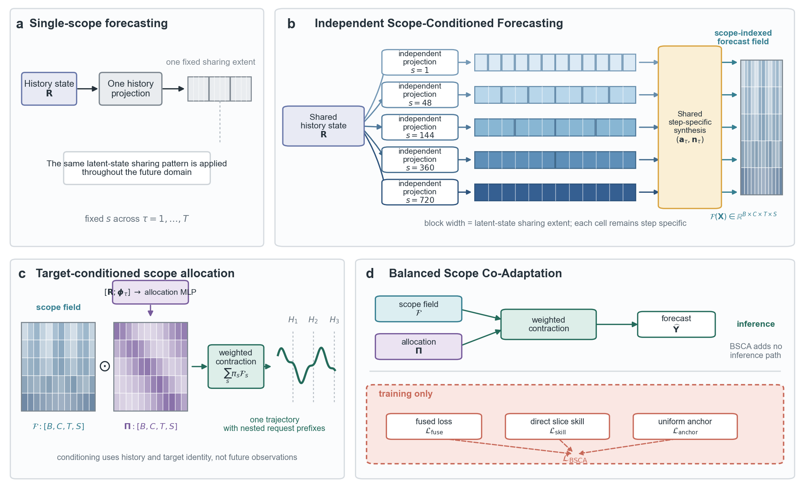

# ISCF-BSCA Section 4: Method

## Draft status

| Field | Content |
| --- | --- |
| `document_role` | Clean manuscript-facing initial draft of Section 4 |
| `version` | `v0.7-bsca-narrative-order-refinement` |
| `date` | `2026-08-10` |
| `review_status` | `author_feedback_integrated_for_section_4.5_narrative_order` |
| `upstream_dependency` | Introduction v0.9 and Section 3 v0.7 remain frozen and unchanged |
| `method_contract` | Exact frozen ISCF-BSCA-v1 architecture and objective |
| `figure_4_status` | Visual design temporarily fixed by the author; stable vector-asset synchronization remains pending |
| `implementation_change` | None |
| `experiment_change` | None |
| `claim_boundary` | Architectural properties remain construction facts; complexity is deferred to the later efficiency analysis, while ablation and transfer claims remain table-contingent |
| `narrative_spine` | History State and Future Coordinate → Scope-conditioned Forecasts and Scope Probabilities → weighted contraction → Varied-Horizon Forecasting → balanced co-adaptation |

The status table, terminology ledger and editorial audit are working metadata and are not part of the manuscript body submitted for review.

## Terminology ledger

| Canonical term | Symbol | Meaning in Section 4 |
| --- | --- | --- |
| Maximum future domain | $T$ | Largest supported future-step index |
| Sharing scope | $s$ | Number of contiguous future steps that reuse one Scope-region State |
| Scope set | $\mathcal S$ | Supported latent-state sharing scopes, with $S=|\mathcal S|$ |
| History Series | $\mathbf X$ | Multivariate look-back window supplied to the forecaster |
| Patchify | -- | Division of each variable history into $P$ temporal patches |
| Encoder | $\mathcal E$ | Shared patch-processing backbone |
| History State | $\mathbf R=[\mathbf r_{b,c}]$ | Variable-wise representation produced by Patchify and the shared Encoder |
| Future Coordinate | $\boldsymbol\Phi=[\boldsymbol\phi_1,\ldots,\boldsymbol\phi_T]^\top$ | Fixed coordinate field identifying future steps |
| Scope Projection | $\mathbf W^{(s)},\mathbf b^{(s)}$ | Independent history projection assigned to sharing scope $s$ |
| Region Descriptor | $\overline{\boldsymbol\phi}_g^{(s)}$ | Mean Future Coordinate within region $\mathcal G_g^{(s)}$ |
| Scope Matrix | $\mathbf M_{b,c}^{(s)}$ | Scope-specific matrix produced from the History State by Scope Projection |
| Scope-region State | $\mathbf z_{b,c,g}^{(s)}$ | History-conditioned state shared within region $g$ under scope $s$ |
| Region-to-Step Forecast Generator | $\mathbf a_\tau,\mathbf n_\tau,\beta_\tau$ | Shared step-specific parameters that map a Scope-region State to future-step predictions |
| Scope-conditioned Forecast | $\mathcal F^{(s)}$ | Forecast slice generated under one sharing scope; not an independent forecasting model |
| Scope-indexed forecast field | $\mathcal F_\theta(\mathbf X)$ | Collection of Scope-conditioned Forecasts indexed by variable, future step and sharing scope |
| Scope Forecasting Path | -- | Region-wise construction of the scope-indexed forecast field |
| Condition Vector | $[\mathbf u_{b,c};\boldsymbol\phi_\tau]$ | Concatenation of a projected History State and the target Future Coordinate |
| Allocation MLP | $\mathbf W_p,\mathbf W_o$ | Network that maps the Condition Vector to scope logits |
| Scope Probabilities | $\boldsymbol\Pi=[\pi_{b,c,\tau,s}]$ | Normalized scope weights produced by the Allocation MLP |
| Target-Adaptive Allocation Path | -- | Target-wise assignment of scope-conditioned information using the History State and Future Coordinate |
| Weighted contraction | $\sum_s\pi_s\mathcal F_s$ | Integration of scope-conditioned forecasts along the scope axis |
| Varied-Horizon Forecasting | $\widehat{\mathbf Y}^{(H)}$ | Return of the first $H$ steps from one maximum-length prediction trajectory |
| Uniform-Prefix Forecasting Loss | $\mathcal L_{\mathrm{prefix}}$ | Fused forecasting loss that weights every prefix horizon equally |
| Scope-Wise Forecasting Loss | $\mathcal L_{\mathrm{scope}}$ | Direct prediction loss applied uniformly to every Scope-conditioned Forecast |
| Allocation-Balance Regularizer | $\mathcal L_{\mathrm{balance}}$ | Ramped regularizer that penalizes strongly non-uniform Scope Probabilities during training |
| Balanced Scope Co-Adaptation | BSCA | Joint training objective combining uniform-prefix forecasting, direct scope supervision and allocation balancing |

## 4. ISCF-BSCA

Section 3 established two requirements for varied-horizon forecasting. Predictions for a shared future target should be invariant to the requested horizon, while the decoder should not impose one latent-state sharing extent on the entire future domain. We address these requirements with ISCF-BSCA. Independent Scope-Conditioned Forecasting (ISCF) is a decoder-side architecture that constructs one future-step-indexed trajectory from multiple sharing scopes, while Balanced Scope Co-Adaptation (BSCA) is the joint optimization method designed for it.

### 4.1 Architecture overview

Figure 4 summarizes the forward computation of ISCF, which organizes its decoder into a **Scope Forecasting Path** and a **Target-Adaptive Allocation Path**. The architecture consumes a variable-wise History State rather than relying on a particular Encoder. Any Encoder that models temporal patch tokens and returns the required tensor interface can therefore serve as its backbone. This interface covers the patch-based Encoder family commonly used in time-series forecasting. Given a History Series $\mathbf X\in\mathbb R^{B\times L\times C}$, Patchify and the Encoder produce $\mathbf R\in\mathbb R^{B\times C\times R}$. The Scope Forecasting Path constructs region-wise predictions under each sharing scope and assembles them into $\mathcal F_\theta(\mathbf X)\in\mathbb R^{B\times C\times T\times S}$. The Target-Adaptive Allocation Path then determines how each future target draws on these sharing granularities.

The Target-Adaptive Allocation Path combines a projected History State with the Future Coordinate $\boldsymbol\phi_\tau$ and produces Scope Probabilities $\boldsymbol\Pi\in\mathbb R^{B\times C\times T\times S}$. Weighted contraction with the scope-indexed forecast field yields one trajectory $\widehat{\mathbf Y}\in\mathbb R^{B\times T\times C}$. For an $H$-step request, the region-local construction permits computation to be restricted to regions and targets intersecting the first $H$ steps. The requested horizon changes only the evaluated prefix, not the computation assigned to a shared future target. ISCF therefore produces variable-length outputs while satisfying CHPC by construction.

The Scope-conditioned Forecasts and Scope Probabilities are optimized jointly. BSCA separates two training roles: the Uniform-Prefix Forecasting Loss optimizes varied-horizon prediction, while the Scope-Wise Forecasting Loss and Allocation-Balance Regularizer stabilize multi-scope learning. These objectives are described separately from the forward computation in Figure 4.

**Figure 4 | ISCF constructs one trajectory for Varied-Horizon Forecasting.** The Scope Forecasting Path generates region-wise predictions under multiple sharing scopes. The Target-Adaptive Allocation Path assigns scope-conditioned information to each future target. Weighted contraction yields one trajectory whose nested prefixes answer different horizon requests. Three representative scopes are shown for clarity; the probability map and trajectories are schematic.

### 4.2 History state and future coordinate

ISCF begins with the History State and Future Coordinate shown on the left of Figure 4. The History Series is normalized per variable, divided into $P$ patches by Patchify and processed by the shared Encoder. This produces $\mathbf Z\in\mathbb R^{B\times C\times P\times D_e}$, which is flattened over its patch and embedding dimensions:

$$
\mathbf Z
=
\mathcal E\!\left(\mathcal N(\mathbf X)\right),
\qquad
\mathbf r_{b,c}
=
\operatorname{vec}(\mathbf Z_{b,c})
\in\mathbb R^R,
\qquad
R=PD_e.
$$

Collecting $\mathbf r_{b,c}$ over samples and variables gives the History State $\mathbf R=[\mathbf r_{b,c}]\in\mathbb R^{B\times C\times R}$. The preserved variable axis provides one history representation for each sample-variable pair, which is used by both decoder paths. ISCF requires only this tensor interface and does not otherwise constrain the internal design of the patch-token Encoder.

The History State summarizes the observed series, but a unified decoder must also identify where each prediction lies in the future domain. Using the requested horizon for this purpose would assign different conditioning contexts to the same target under different requests. ISCF instead introduces a **Future Coordinate** for every future step. This fixed coordinate supplies a horizon-independent target identity and a common positional basis for regions at different scopes. It also allows the Target-Adaptive Allocation Path to vary its scope preference across future steps.

Formally, the Future Coordinate is the field $\boldsymbol\Phi=[\boldsymbol\phi_1,\ldots,\boldsymbol\phi_T]^\top\in\mathbb R^{T\times D_q}$. We construct it from low-order discrete cosine functions, which provide smooth coordinate channels at progressively finer temporal frequencies. For $d=0,\ldots,D_q-1$, we first define

$$
\widetilde\phi_{\tau,d}
=
\cos\!\left(
\frac{\pi(\tau-\tfrac12)d}{T}
\right).
$$

The constant coordinate is $\phi_{\tau,0}=1$. Each nonconstant coordinate is centered over the future domain and scaled as

$$
\phi_{\tau,d}
=
\sqrt{2}
\left(
\widetilde\phi_{\tau,d}
-
\frac{1}{T}
\sum_{j=1}^{T}
\widetilde\phi_{j,d}
\right),
\qquad d\geq 1.
$$

The constant channel preserves a global reference, while the centered nonconstant channels distinguish positions across the future domain. The resulting parameter-free field serves two roles. Region-wise averaging produces the Region Descriptors used to generate Scope-conditioned Forecasts, whereas the unpooled coordinate $\boldsymbol\phi_\tau$ identifies the individual target in the Condition Vector used for Scope Probabilities.

### 4.3 Generation of scope-conditioned forecasts

The Scope Forecasting Path contains $S$ parallel scope lines, one for each sharing scope in $\mathcal S=\{s_1,\ldots,s_S\}$. A single Scope Projection stage contains an independently parameterized projection for every scope, so each line receives a dedicated Scope Matrix as its history-conditioned information pool. The matrix form is important because it retains a Future-Coordinate axis and a latent-mode axis. Region Descriptors can therefore query the same scope-specific history information at different future locations, without assigning a separate prediction head to every region.

For a scope $s$, the future domain is divided into contiguous regions

$$
\mathcal G_g^{(s)}
=
\{(g-1)s+1,\ldots,gs\},
\qquad
g=1,\ldots,T/s.
$$

The Future Coordinate within each region is averaged to form the Region Descriptor:

$$
\overline{\boldsymbol\phi}_g^{(s)}
=
\frac{1}{s}
\sum_{\tau\in\mathcal G_g^{(s)}}
\boldsymbol\phi_\tau
\in\mathbb R^{D_q}.
$$

For each scope, Scope Projection maps $\mathbf r_{b,c}$ into its dedicated Scope Matrix

$$
\mathbf M_{b,c}^{(s)}
=
\operatorname{reshape}_{D_q\times K}
\left(
\mathbf r_{b,c}\mathbf W^{(s)}
+
\mathbf b^{(s)}
\right)
\in\mathbb R^{D_q\times K}.
$$

The Region Descriptor selects and combines information from this matrix through a coordinate contraction, producing the region-wise Scope-region State

$$
\mathbf z_{b,c,g}^{(s)}
=
\left(\overline{\boldsymbol\phi}_g^{(s)}\right)^\top
\mathbf M_{b,c}^{(s)}
\in\mathbb R^K.
$$

Once the Scope Matrix is available, each Scope-region State depends only on the descriptor of its own region. Regions can therefore be evaluated separately and in parallel, although they draw on the same scope-specific history information. All future steps in $\mathcal G_g^{(s)}$ reuse $\mathbf z_{b,c,g}^{(s)}$. A finer scope constructs more region states and limits reuse to shorter intervals, whereas a broader scope shares each state over a longer interval. Scope thus defines a cross-step reuse pattern rather than a requested prediction horizon.

The Region-to-Step Forecast Generator converts each shared Scope-region State into step-wise predictions. Let $g_s(\tau)$ denote the region containing step $\tau$. The generator is shared across scopes and regions, and uses step-specific vectors $\mathbf a_\tau,\mathbf n_\tau\in\mathbb R^K$ and bias $\beta_\tau$ to define

$$
\mathcal F_{b,c,\tau,s}
=
\left\langle
\mathbf a_\tau,
\mathbf z_{b,c,g_s(\tau)}^{(s)}
\right\rangle
+
\left\langle
\mathbf n_\tau,
\operatorname{GELU}\!\left(
\mathbf z_{b,c,g_s(\tau)}^{(s)}
\right)
\right\rangle
+
\beta_\tau.
$$

Concatenating the separately generated regions gives the Scope-conditioned Forecast $\mathcal F^{(s)}$ for scope $s$. Collecting these forecasts produces the scope-indexed field $\mathcal F_\theta(\mathbf X)\in\mathbb R^{B\times C\times T\times S}$. Rather than ensembling separately trained models, ISCF jointly constructs this field through scope-specific projections and a shared Encoder and Region-to-Step Forecast Generator. This design couples forecast synthesis across scopes while avoiding duplicated encoder computation and generator parameters.

### 4.4 Target-adaptive scope allocation

Different future targets may require information organized at different sharing granularities. Estimating this preference requires both the dynamics encoded in the observed history and the target position in the future domain. The Target-Adaptive Allocation Path represents these two signals using a compact history summary and the Future Coordinate. It first projects the History State as

$$
\mathbf u_{b,c}
=
\mathbf W_h\mathbf r_{b,c}
+
\mathbf b_h
\in\mathbb R^{D_h}.
$$

The compact summary $\mathbf u_{b,c}$ retains the sample-variable context used for allocation. For future step $\tau$, the Condition Vector concatenates this summary with $\boldsymbol\phi_\tau$. The Allocation MLP maps the resulting vector to scope logits

$$
\boldsymbol\ell_{b,c,\tau}
=
\mathbf W_o
\operatorname{GELU}\!\left(
\mathbf W_p
[\mathbf u_{b,c};\boldsymbol\phi_\tau]
+
\mathbf b_p
\right)
+
\mathbf b_o
\in\mathbb R^S,
$$

$$
\pi_{b,c,\tau,s}
=
\frac{
\exp(\ell_{b,c,\tau,s})
}{
\sum_{s'=1}^{S}
\exp(\ell_{b,c,\tau,s'})
}.
$$

Softmax converts these logits into the Scope Probability $\pi_{b,c,\tau,s}$ assigned to scope $s$. Collecting all probabilities gives $\boldsymbol\Pi\in\mathbb R^{B\times C\times T\times S}$, with $\sum_{s=1}^{S}\pi_{b,c,\tau,s}=1$. Each probability vector parameterizes how strongly a future target draws on information organized at different sharing granularities. The final normalized prediction reads from the unified scope-indexed forecast field through weighted contraction:

$$
\widehat y_{b,\tau,c}
=
\sum_{s=1}^{S}
\pi_{b,c,\tau,s}
\mathcal F_{b,c,\tau,s}.
$$

This contraction is not an average over separately trained model outputs. The Scope Forecasting Path and Target-Adaptive Allocation Path are jointly learned within one decoder, allowing each target to receive a history-conditioned mixture of sharing granularities.

For an $H$-step request, ISCF needs only the Scope-region States whose regions intersect $1{:}H$ and the allocation entries for $\tau\leq H$. The resulting normalized prefix is transformed back to the original data scale and returned as

$$
\widehat{\mathbf Y}_b^{(H)}
=
\left[
\widehat y_{b,\tau,c}
\right]_{\tau=1,\ldots,H;\ c=1,\ldots,C}.
$$

Changing $H$ restricts the active region and target computations but does not alter any prediction shared with a longer request. Every request is therefore a nested view of the same trajectory. The learned probabilities represent target-adaptive information allocation rather than an oracle scope selector. Later ablations and internal-behavior analyses evaluate whether this allocation yields useful scope differentiation.

### 4.5 Balanced Scope Co-Adaptation

Training ISCF introduces two coupled requirements. The fused trajectory requires uniform supervision across supported prefix lengths, while all scope lines must develop reliable forecasts as allocation is learned. BSCA therefore combines the **Uniform-Prefix Forecasting Loss** for varied-horizon prediction with two terms that stabilize multi-scope learning: the **Scope-Wise Forecasting Loss** and **Allocation-Balance Regularizer**.

Varied-horizon training should optimize every supported prediction length without privileging one endpoint. We therefore average raw-scale MAE equally over all prefixes $h=1,\ldots,T$ to define the Uniform-Prefix Forecasting Loss. Before loss evaluation, inverse normalization maps the fused and Scope-conditioned Forecasts to the original data scale. Let $y_{b,\tau,c}$ denote the corresponding raw-scale target. The fused objective is

$$
\mathcal L_{\mathrm{prefix}}
=
\frac{1}{T}
\sum_{h=1}^{T}
\frac{1}{BCh}
\sum_{b=1}^{B}
\sum_{c=1}^{C}
\sum_{\tau=1}^{h}
\left|
\widehat y_{b,\tau,c}-y_{b,\tau,c}
\right|.
$$

Exchanging the prefix and future-step summations gives an equivalent dense-prefix measure

$$
\omega_\tau
=
\frac{1}{T}
\sum_{h=\tau}^{T}
\frac{1}{h},
\qquad
\sum_{\tau=1}^{T}\omega_\tau=1.
$$

Under this measure, every prefix endpoint contributes equally, while a future step is weighted by the number of prefixes containing it. The same loss can therefore be written as

$$
\mathcal L_{\mathrm{prefix}}
=
\frac{1}{BC}
\sum_{b=1}^{B}
\sum_{c=1}^{C}
\sum_{\tau=1}^{T}
\omega_\tau
\left|
\widehat y_{b,\tau,c}-y_{b,\tau,c}
\right|.
$$

The Uniform-Prefix Forecasting Loss establishes the varied-horizon objective, but it does not resolve the joint optimization of multiple scope lines. Weighted contraction makes the fused-loss gradient received by each scope depend on its current Scope Probability. For a fixed target, this relation gives

$$
\frac{
\partial\mathcal L_{\mathrm{prefix}}
}{
\partial\mathcal F_{b,c,\tau,s}
}
=
\pi_{b,c,\tau,s}
\frac{
\partial\mathcal L_{\mathrm{prefix}}
}{
\partial\widehat y_{b,\tau,c}
}.
$$

Consequently, early probability concentration can suppress learning in low-probability scope lines before their forecasts mature. The allocator then compares unevenly developed predictions, which can reinforce its initial preference. We first address this imbalance with the Scope-Wise Forecasting Loss, which applies the same prefix measure directly to every Scope-conditioned Forecast:

$$
\mathcal L_{\mathrm{scope}}
=
\frac{1}{BCS}
\sum_{b=1}^{B}
\sum_{c=1}^{C}
\sum_{s=1}^{S}
\sum_{\tau=1}^{T}
\omega_\tau
\left|
\mathcal F_{b,c,\tau,s}-y_{b,\tau,c}
\right|.
$$

This term gives every scope a direct prediction gradient independent of its current Scope Probability. Direct supervision alone, however, does not regulate how the fused predictor distributes probability-mediated gradients. We therefore introduce the Allocation-Balance Regularizer using the uniform reference $q_s=1/S$:

$$
\mathcal L_{\mathrm{balance}}
=
\frac{1}{BC}
\sum_{b=1}^{B}
\sum_{c=1}^{C}
\sum_{\tau=1}^{T}
\omega_\tau
\frac{
D_{\mathrm{KL}}\!\left(
\mathbf q\,\Vert\,\boldsymbol\pi_{b,c,\tau}
\right)
}{
\log S
}.
$$

The complete objective is

$$
\mathcal L_{\mathrm{BSCA}}
=
\mathcal L_{\mathrm{prefix}}
+
\lambda_{\mathrm{scope}}
\mathcal L_{\mathrm{scope}}
+
\lambda_{\mathrm{balance}}(u)
\mathcal L_{\mathrm{balance}},
$$

where $u\in[0,1]$ is optimizer progress. In the frozen configuration, $\lambda_{\mathrm{scope}}=1$ and

$$
\lambda_{\mathrm{balance}}(u)
=
0.1
\min\!\left(
\frac{u}{0.25},1
\right).
$$

The regularizer penalizes strongly non-uniform Scope Probabilities, discouraging a small subset of scopes from dominating early optimization. Its ramp introduces this pressure gradually as the forecasting paths develop. This pressure promotes broader allocation and a more even distribution of probability-mediated gradients across scope lines. Together with direct scope supervision, it supports more balanced multi-scope optimization.

## Editorial implementation and claim audit

| Manuscript element | Frozen implementation correspondence | Permitted claim | Deferred claim |
| --- | --- | --- | --- |
| History State | Normalization, Patchify, Encoder and flattened `hidden:[B,C,R]` | ISCF is compatible with patch-token Encoders that satisfy the stated tensor interface | Encoder superiority or empirical transfer across arbitrary backbones |
| Scope Projection and Scope Matrix | Independent SIFF scale basis with one component per scope | Each scope has an independent Scope Projection | Each Scope-conditioned Forecast is an independent forecasting model |
| Region Descriptor and Scope-region State | Contiguous group indices and pooled Future Coordinates | Scope controls state-reuse extent | Canonical partition is universally optimal |
| Region-to-Step Forecast Generator | Shared step-specific linear and nonlinear synthesis parameters | One shared state can produce distinct step-specific predictions | The generator is universally transferable |
| Scope Forecasting Path | One Encoder evaluation, independent scope projections and shared synthesis produce `arm_forecasts:[B,C,T,S]` | One unified field couples shared representation and synthesis across scope lines | Lower compute than every unified alternative or learned scope specialization |
| Target-Adaptive Allocation Path | Direct History-State-plus-target-coordinate policy produces `[B,C,T,S]` | Each target receives a learned allocation over sharing granularities | Oracle scope recovery or necessarily region-optimal allocation |
| Weighted contraction and prefix output | Scope-axis weighted sum yields `[B,T,C]`; the reference implementation materializes the full field before prefix slicing | One horizon-agnostic trajectory, CHPC and architecture-level support for prefix-bounded region evaluation | Realized latency gains from prefix-bounded execution or lower error than horizon-specific systems |
| BSCA | Uniform-Prefix Forecasting Loss plus direct Scope-Wise Forecasting Loss and ramped normalized `KL(uniform || allocation)` | Direct scope supervision and more balanced probability-mediated optimization | Guaranteed equal training, generic KL novelty, universal gain or semantic specialization |
| Section 5 interface | Main, ablation, transfer and efficiency analyses | Complexity and empirical effects are evaluated outside Section 4 | Component attribution and decoder portability remain table-contingent |
