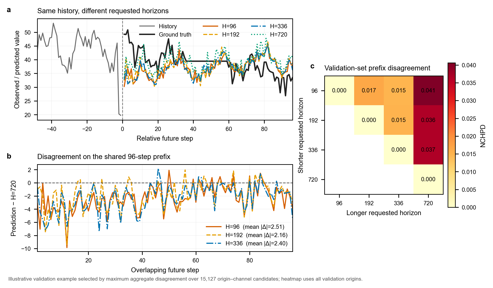
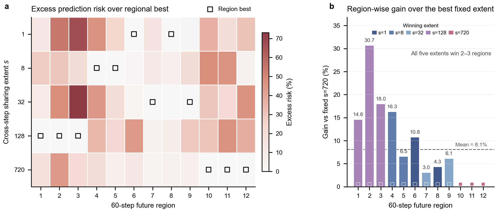

# HoriScope Section 3: Problem Formulation and Empirical Motivation

## Draft status

| Field | Content |
| --- | --- |
| `document_role` | Clean manuscript-facing initial draft of Section 3 |
| `version` | `v0.7-author-risk-definition-refinement` |
| `date` | `2026-08-04` |
| `review_status` | `temporarily_frozen_usable` |
| `freeze_scope` | Section 3 body, terminology, equations, Figures 2--3 integration and captions |
| `unfreeze_condition` | A concrete contradiction from later sections or evidence, followed by explicit author approval |
| `introduction_dependency` | Introduction `v0.9-author-refinement` remains unchanged |
| `figure_2_status` | Approved validation-only illustrative evidence; integrated below |
| `figure_3_status` | Approved validation-only illustrative evidence; integrated below |
| `method_figure_4_status` | Planned only; not generated or referenced as completed |
| `result_boundary` | No main-table, ablation or transfer claim is treated as established |
| `narrative_spine` | CHPC task contract → observed horizon-specific inconsistency → future-region sharing-demand heterogeneity → decoder motivation |

The status table and the editorial audit after Section 3 are not part of the manuscript body submitted for review.

## Terminology ledger

| Term | Symbol | Meaning in this section |
| --- | --- | --- |
| Forecast horizon | $H$ | The requested maximum number of future steps |
| Future time step | $\tau$ | A position within the forecast domain, $1\leq\tau\leq H$ |
| Forecast target | $(\tau,c)$ | Future step $\tau$ of variable $c$ |
| Cross-horizon prefix consistency | CHPC | Invariance of shared-prefix predictions to the requested horizon |
| Cross-horizon prefix inconsistency | — | Violation of CHPC by horizon-specific predictions on shared future targets |
| Cross-horizon prefix disagreement | CHPD | Raw-scale disagreement between overlapping horizon-specific forecasts |
| Normalized CHPD | NCHPD | CHPD normalized by train-split variable scale |
| Future region | $\mathcal B_b$ | A contiguous subset of future steps, not a requested horizon |
| Sharing extent | $s$ | The number of future steps that reuse one history-conditioned latent state |
| Future-region prediction risk | $R_{o,b,s}$ | Empirical squared-error loss of extent $s$ over all targets in region $\mathcal B_b$ at origin $o$ |

## 3. Problem Formulation and Empirical Motivation

The preceding discussion shows that UVHF involves more than sharing parameters across prediction lengths. A unified forecaster should return coherent predictions for future steps shared by different horizon requests, while its decoder must determine how predictive information is shared across the future domain. We now formalize these two issues and examine them through controlled empirical analyses, which motivate the decoder design developed in Section 4.

### 3.1 Unified varied-horizon forecasting and cross-horizon prefix consistency

Consider two forecasting requests with horizons $H_i<H_j$ issued from the same observed history. Their first $H_i$ steps refer to identical future targets and should therefore receive identical predictions. We formalize this requirement below.

At forecast origin $o$, let

$$
\mathbf X_o
=
\left[\mathbf x_{o-L+1},\ldots,\mathbf x_o\right]
\in\mathbb R^{L\times C},
\qquad
\mathbf Y_o^{(H)}
=
\left[y_{o+\tau,c}\right]_{\tau=1,\ldots,H;\ c=1,\ldots,C}
\in\mathbb R^{H\times C}.
$$

Here, $\mathbf X_o$ is a length-$L$ multivariate history, and $\mathbf Y_o^{(H)}$ contains the next $H$ targets for $C$ variables. Let $\mathcal H=\{H_1,\ldots,H_M\}$ denote the supported horizons and $T=\max\mathcal H$. The horizon $H$ specifies the request endpoint, whereas $\tau$ indexes a particular future step. Thus, target $(\tau,c)$ is shared by all requests with $H\geq\tau$.

This shared-target relation defines **cross-horizon prefix consistency (CHPC)**. Let $\widehat y_{o+\tau,c}^{(H)}$ denote the prediction returned for target $(\tau,c)$ under a request with horizon $H$. Given identical history, forecast origin and preprocessing, CHPC requires

$$
\widehat y_{o+\tau,c}^{(H_i)}
=
\widehat y_{o+\tau,c}^{(H_j)},
\qquad
\forall\,H_i,H_j\in\mathcal H,\ H_i<H_j,\quad
1\leq\tau\leq H_i,\quad
1\leq c\leq C.
$$

Conventional long-term forecasting learns an independent predictor $f_{\theta_H}$ for each horizon. Because both parameters and optimization are horizon-specific, these predictors are not constrained to satisfy CHPC on their overlapping outputs.

A varied-horizon forecaster should instead use a single **future-step-indexed prediction function** $g_\theta(\mathbf X_o,\tau,c)$ and construct an $H$-step forecast as

$$
\widehat{\mathbf Y}_o^{(H)}
=
\left[
g_\theta(\mathbf X_o,\tau,c)
\right]_{\tau=1,\ldots,H;\ c=1,\ldots,C}.
$$

For a varied-horizon forecaster, all horizon requests query the same function at a shared target, so CHPC holds by construction. Changing the requested horizon alters only the returned prefix length, and each request becomes a nested view of one predicted trajectory.

### 3.2 Horizon-specific prefix inconsistency

Independently trained horizon-specific predictors may agree on some overlapping outputs, but their objectives do not enforce CHPC. We refer to a violation of CHPC as **cross-horizon prefix inconsistency** and quantify its magnitude through prediction disagreement on aligned histories and shared future targets.

At origin $o$, let $\widehat{\mathbf Y}_{o}^{(H_i)}\in\mathbb R^{H_i\times C}$ and $\widehat{\mathbf Y}_{o}^{(H_j)}\in\mathbb R^{H_j\times C}$ denote forecasts from independently trained models, where $H_i<H_j$. We define their **cross-horizon prefix disagreement (CHPD)** as

$$
\operatorname{CHPD}_o(H_i,H_j)
=
\frac{1}{H_iC}
\sum_{\tau=1}^{H_i}
\sum_{c=1}^{C}
\left|
\widehat y_{o+\tau,c}^{(H_i)}
-
\widehat y_{o+\tau,c}^{(H_j)}
\right|.
$$

CHPD measures the mean absolute difference over the shared prefix in the original data scale. To aggregate variables with different magnitudes, we further define normalized CHPD (NCHPD):

$$
\operatorname{NCHPD}(H_i,H_j)
=
\frac{1}{|\mathcal O|C}
\sum_{o\in\mathcal O}
\sum_{c=1}^{C}
\frac{
\frac{1}{H_i}\sum_{\tau=1}^{H_i}
\left|
\widehat y_{o+\tau,c}^{(H_i)}
-
\widehat y_{o+\tau,c}^{(H_j)}
\right|
}{
\sigma_c^{\mathrm{train}}+\epsilon
}.
$$

Here, $\mathcal O$ denotes the aligned evaluation origins, $\sigma_c^{\mathrm{train}}$ is the train-split standard deviation of variable $c$, and $\epsilon$ is the fixed numerical stabilizer used in the computation. All comparisons use identical histories, forecast origins, scalers and overlapping target indices.

To visualize this inconsistency, we compare multi-horizon forecasts from DLinear models independently optimized on ETTh2 \citep{zeng2023dlinear}. Figure 2a shows that their predictions diverge over the same 96 future steps: relative to the $H=720$ forecast, the forecasts for $H\in\{96,192,336\}$ differ by 2.51, 2.16 and 2.40 in mean absolute raw scale, respectively.

We further evaluate all 2,161 aligned ETTh2 validation origins and variables, with the resulting NCHPD matrix shown in Figure 2b. NCHPD is non-zero for every horizon pair and is more pronounced between the longest and shorter requested horizons: the $H=96$, $H=192$ and $H=336$ comparisons with $H=720$ yield 0.0406, 0.0365 and 0.0366, whereas pairs among the three shorter horizons range from 0.0148 to 0.0166. These results show that the independently optimized DLinear models evaluated here fail to form a prefix-consistent prediction trajectory, reflecting a structural limitation of horizon-specific forecasting: independently optimized models are not constrained to agree on shared future targets.

**Figure 2 | Horizon-specific forecasts disagree on shared future steps.** **a**, Selected ETTh2 validation trajectory from independently trained DLinear models for horizons 96, 192, 336 and 720; the inset reports differences from the $H=720$ forecast. **b**, NCHPD over 2,161 aligned ETTh2 validation origins and all variables.

### 3.3 Future-region sharing-demand heterogeneity

CHPC specifies how predictions from different horizon requests should relate, but it does not determine how a unified decoder should construct the shared future trajectory. Simply adapting an architecture designed for one fixed horizon leaves this output-side requirement unresolved: a varied-horizon forecaster must learn from requests spanning short to long endpoints while producing one prefix-consistent trajectory. The decoder is therefore central to how predictive information is organized across the future domain, particularly in determining how broadly each history-conditioned state is reused before step-specific prediction.

We use the **sharing extent** $s$ to denote the number of future steps that reuse one latent state. A **future region** $\mathcal B_b\subseteq\{1,\ldots,T\}$ is a contiguous subset of the maximum future domain rather than a requested horizon. Broad sharing can capture persistent trajectory structure but may smooth local variations, whereas fine sharing offers greater local flexibility with weaker cross-step regularization. We refer to variation in the preferred extent across regions as **future-region sharing-demand heterogeneity**.

To isolate this factor, we construct capacity-matched single-extent predictors that differ only in sharing extent; all other architecture, training and evaluation settings remain identical.

For aligned origin $o$, we define the **future-region prediction risk** of sharing extent $s$ over region $\mathcal B_b$ as the empirical squared-error loss

$$
R_{o,b,s}
=
\frac{1}{|\mathcal B_b|C}
\sum_{\tau\in\mathcal B_b}
\sum_{c=1}^{C}
\left(
\widehat y_{o+\tau,c}^{(s)}
-
y_{o+\tau,c}
\right)^2.
$$

For a given origin and region, $R_{o,b,s}$ averages squared errors over the region's future steps and variables. Lower $R_{o,b,s}$ indicates that extent $s$ better matches region $\mathcal B_b$ within the controlled family; a region-dependent preference appears when $s_{o,b}^{\star}=\arg\min_sR_{o,b,s}$ changes with $b$.

We evaluate the five predictors with $s\in\{1,8,32,128,720\}$ across 12 contiguous 60-step future regions on ETTm2. Figure 3a reports the percentage excess prediction risk of each extent above the lowest-risk extent within each region, with outlined squares marking the region-wise winners. The preferred extents vary across the future domain: each of the five extents wins two or three regions, and the mean best-versus-second-best margin reaches 10.266%. No fixed extent minimizes prediction risk throughout this controlled example, supporting heterogeneous sharing demand across future regions.

**Figure 3 | Sharing preferences vary across future regions.** **a**, Percentage excess prediction risk of five capacity-matched single-extent predictors on a selected ETTm2 validation example; squares mark regional winners. **b**, MSE reduction from regional selection relative to the fixed extent $s=720$; dashed line, mean over 12 regions.

Figure 3b quantifies the performance upper bound associated with these region-wise preferences. Relative to the best fixed extent ($s=720$), selecting the lowest-risk extent separately for each region reduces average MSE by 8.112%. Because the regional winners are selected using validation labels across separately trained predictors, this value represents descriptive oracle headroom rather than the realized gain of a learned decoder. Within this controlled example, its magnitude nevertheless shows that one fixed extent can leave meaningful region-specific headroom, motivating a decoder that can adapt sharing across the future domain.

## Editorial evidence and claim audit

| Item | Evidence status | Permitted Section 3 claim | Prohibited promotion |
| --- | --- | --- | --- |
| Task formulation and CHPC | Mathematical definition | A horizon-agnostic future-step-indexed mapping satisfies CHPC by construction | CHPC implies lower forecast error |
| Figure 2 | Selected DLinear trajectory plus all-validation ETTh2 NCHPD | The independently optimized DLinear models evaluated here do not form one prefix-consistent trajectory | Inconsistency is universal across model families or implies lower horizon-specific accuracy |
| Figure 3 | Validation-selected, capacity-matched, single-origin illustration | Preferred sharing extent varies across future regions, with 8.112% descriptive oracle headroom in the selected example | Oracle headroom is learnable, out-of-sample or attributable to HoriScope |
| Method transition | Deferred to Section 4 | Section 3 motivates decoder design through CHPC and sharing-demand heterogeneity | Figures 2--3 establish unified superiority, component effectiveness or decoder transferability |
